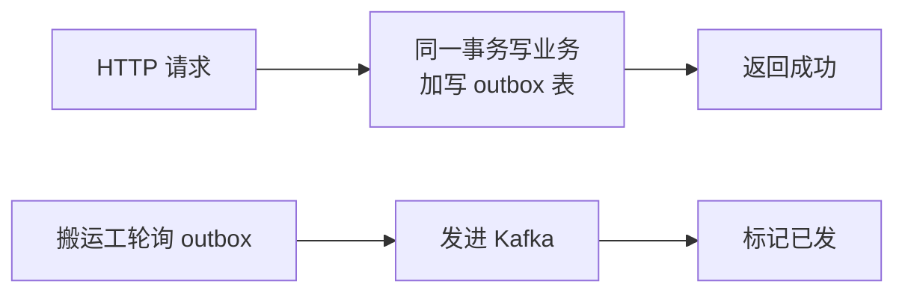

---
kernelspec:
  name: book-venv
  display_name: Python 3 (book)
---

# 消息队列与 Kafka

上一节让热数据放手边，这一节回到请求本身。到目前为止，接口都有一个隐含前提：活儿在几百毫秒内能做完。文档上传打破了这个前提，文件传完只是开始，后面还有解析、切分、建索引，几十秒起步；让用户在浏览器前对着转圈等，请求会先超时。这类活儿不能放在请求里做，得挪到后台，请求只负责下单，后台慢慢执行。承接这件事的基础设施就是消息队列。

本节先讲什么任务该进队列，再看队列里有哪些角色、任务怎么流动，然后处理两个最现实的麻烦，重复和丢失，最后谈顺序与落地的取舍。Kafka 是这类系统里最有名的选手，本节以它为例，但思路不绑定任何产品。

## 进队列的任务

先说清楚判断标准：什么任务该进队列。

进队列的任务有三个特征：耗时久、可异步、可重试。文档上传后要解析建索引，几十秒跑完，用户不可能对着转圈等；解析结果晚一分钟出来没人投诉，但请求超时了人人都要骂。所以 HTTP 只做两件事：把任务写进队列、把任务号返回给前端，解析在后台慢慢做，前端拿着任务号轮询进度。

判断的口径只有一条：用户等不等得起。等不起但结果可以晚到，进队列；几百毫秒能从数据库取回答案，直接在请求里做完，不要为异步而异步。至于用什么工具实现队列，团队量小可以先上 Celery 这类轻量方案，量大了再迁到 Kafka，本节以 Kafka 为例，思路是通用的。

## 生产与消费

任务要进队列，队列里到底有谁、任务怎么流动？

不管哪种队列，抽象都只有三个角色。生产者负责把任务提交进来；队列本身负责把任务排好、存住、等人来取；消费者负责取走任务、执行、汇报结果。用餐厅的比方说，生产者是发号的前台，队列是叫号系统，消费者是按号做菜的后厨。

```python
# 生产者：先连 broker，再入队，HTTP 立即返回任务号
import json

from kafka import KafkaProducer

producer = KafkaProducer(
    bootstrap_servers="localhost:9092",
    value_serializer=lambda v: json.dumps(v).encode("utf-8"),
)
producer.send("doc-parse", key=doc_id.encode("utf-8"), value={"doc_id": doc_id, "file_key": key})
producer.flush()
return {"task_id": doc_id, "status": "pending"}
```

Kafka 是这类系统里的老牌选手，把这套角色又展开成几个名词，和它打交道绕不开。topic 是任务类别的名字，一类任务一个 topic，比如解析任务叫 `doc-parse`；一个 topic 可以切成多个 partition（分区），消息按 key 散进不同分区，多个消费者就能并行地取，这是扛量的单位；consumer group（消费者组）是一组消费者的身份，组里每条消息只会被一个成员取走，往组里加机器就是加消费能力。消费者取任务的代码长这样：

```python
# 消费者：连 broker 与消费者组，循环取活，结果写回库
import json

from kafka import KafkaConsumer

consumer = KafkaConsumer(
    "doc-parse",
    bootstrap_servers="localhost:9092",
    group_id="doc-parse-workers",
    enable_auto_commit=False,
    auto_offset_reset="earliest",
)
for msg in consumer:
    result = parse_document(json.loads(msg.value)["file_key"])
    db.execute("UPDATE documents SET indexed = 1 WHERE id = ?", (msg.key.decode("utf-8"),))
    consumer.commit()
```

代码里的 commit 是向队列确认"这条我处理完了"。正是这个确认机制，引出了下一小节要讲的麻烦。

Kafka 需要真实 broker 才能运行，书中构建不启动容器，本节示例是展示代码。本地要跑真实实例，一条命令起一个单节点 Kafka（官方镜像默认以单节点 KRaft 模式运行），`bootstrap_servers` 指向 `localhost:9092` 即可：

```bash
docker run -d --name kafka -p 9092:9092 apache/kafka:4.3.1
```

## 重复投递

队列有一条不讨喜却必须知道的性质：它保证"至少送到一次"，不保证"只送一次"。

原因在确认机制里。消费者取走消息后，处理完才向队列提交确认；如果它刚处理一半就崩溃，确认没发出去，队列就认为这条消息还无人认领，等消费者重启后重新投递。于是同一条解析任务被执行了两次。重复从队列这端根除不了，只能要求业务这端承受重复：同一件事做一次和做两次，结果一样。这种性质有个名字，叫幂等（idempotent）。

达成幂等最常用的办法是去重表：处理消息之前，先查这张表里有没有它；处理完，把消息 ID 记进去。

```python
# 幂等：处理前先看这条消息做过没有（展示代码）
if db.exists("SELECT 1 FROM processed WHERE msg_id = ?", (msg_id,)):
    consumer.commit()
    continue
do_work(msg)
db.execute("INSERT INTO processed(msg_id) VALUES (?)", (msg_id,))
```

有两个细节容易漏。第一，查重、干活、记 ID 要在同一个事务里，否则活干完了、记录还没落库就崩掉，重启后还是要重做。第二，消息 ID 最好直接用天然唯一的业务 ID，比如文档 ID，省去额外维护一套编号。

## 发件箱

重复是消费端的问题，换到生产端，还有对称的一笔账：消息没发出去怎么办？

设想一个真实顺序：用户点了上传，后端先把文档记录写进数据库，然后发送解析任务。数据库写成功了，发消息那一步赶上网路故障或进程重启，消息就永远没进队列。用户看到上传成功，文件却永远不会被解析，甚至没人发现。这个坑的解法叫发件箱（outbox）：把要发的消息当作业务数据的一部分，和业务记录写进同一个事务，先存进一张 outbox 表。



数据库事务保证业务记录和 outbox 记录同生同死。之后由一个搬运程序轮询 outbox 表，把还没发出去的消息补发进队列，发完标记。消息可能重复，但重复有上一小节的幂等兜着。至此丢失和重复两笔账都算清了。

## 顺序与分区

丢失与重复都兜住了，还剩第三笔账：顺序。

队列默认不保证消息的顺序。同一份文档的"解析完成"完全可能跑到"开始解析"前面，状态机就乱了。Kafka 的顺序保证以分区为单位：同一个 key 的消息进同一个分区，分区内严格有序，分区间不保证。所以想让谁保序，就把谁的 key 定好，比如文档 ID。

| 问题 | 答案 |
| --- | --- |
| 消息保序 | 同 key 进同分区，分区内有序，分区间无序 |
| 加机器提速 | 消费者数不超过分区数，加多了闲着 |
| 消费者崩了 | 组内再均衡，分区转给活着的接着吃，重复用幂等兜 |

代价要一并接受：同一个 key 的活只能串行，并行度被分区数封顶，消费者数量超过分区数就是白加。分区数一般按峰值估好、一次定下，改大容易改小难。顺序也只在需要的地方保，全局保序等于放弃并行。

## 起步与定时

到这里，队列的核心概念就讲完了，最后给两个落地提醒。

一是量小不必上 Kafka。数据库轮询 outbox、进程内内存队列、Celery，都是够用的起点；将来迁移到 Kafka，生产与消费的姿势不变。二是定时类任务通常也归队列管：每天凌晨跑批用调度器，需要延迟到某个时刻执行用延迟队列。本章不展开，用到时知道去哪里查。

## 本节小结

- 耗时久、可异步、可重试的任务进队列，HTTP 只入队返回任务号，判断口径是用户等不等得起。
- 队列的角色只有三个：生产者取号、队列叫号、消费者做菜；topic、partition、consumer group 是这套角色的展开。
- 队列只承诺至少送一次，重复用幂等兜住，去重表要和处理逻辑放在同一事务。
- 生产端可能库里写了、消息没发，用发件箱把业务与消息绑进同一事务，搬运工补发。
- 保序靠同 key 同分区，消费者不超过分区数；量小不必上 Kafka，定时任务也常归它管。
