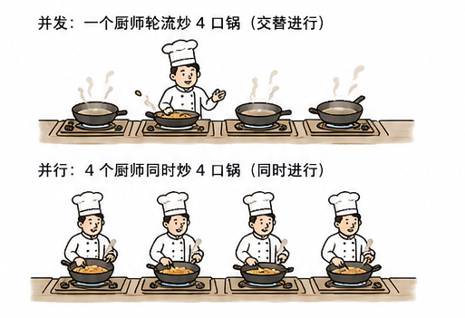
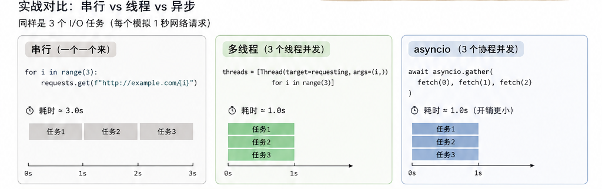
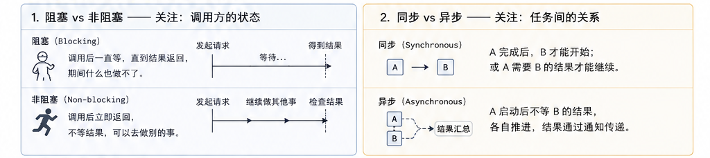
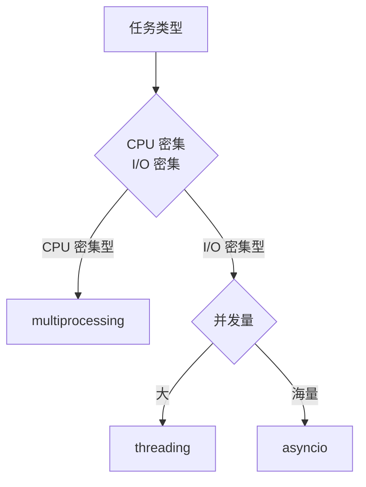

---
kernelspec:
  name: book-venv
  display_name: Python 3 (book)
---

# 并发、并行与异步

学完本节，你能回答：

- 并发和并行的本质区别是什么？为什么说“并发是结构，并行是执行”？
- 阻塞/非阻塞、同步/异步这两对概念分别关注什么？它们之间是什么关系？
- Python 的 threading、multiprocessing、asyncio 三种方案分别解决什么问题？各自适用什么场景？
- 面对一个具体任务，如何做出合理的并发方案选型？



> 并发与并行的混淆，就像把“一个厨师在四个灶台间轮流翻炒”和“四个厨师一人守一个灶台”当成同一件事。前者解决的是“一个人怎么让四口锅都不糊”，后者解决的是“四个人怎么同时出一桌菜”。

并发是计算机科学中一个古老而深刻的话题。它之所以困难，不在于 API 的复杂性，而在于我们对“同时”这个词的理解存在天然的盲区。日常生活中，“同时”指两件事在同一时间发生；而在操作系统的语境里，它可能指真正的并行，也可能指极快的交替。这种语义上的模糊，正是混淆的根源。

## 用耗时对比区分三种“同时做”

在进入概念辨析之前，先看看我们的示例。下面的 Demo 让同一组 50 毫秒 I/O 任务分别走串行、线程和 asyncio 并发，耗时差异本身就是定义。



```{code-cell} python
import time
import threading
import asyncio

def io_task(task_id: int, delay: float = 0.05) -> str:
    time.sleep(delay)
    return f"task-{task_id}"

# 串行：3 个任务各 50 毫秒，约 150 毫秒
t0 = time.perf_counter()
serial_results = [io_task(i) for i in range(3)]
t_serial = time.perf_counter() - t0
print(f"串行耗时: {t_serial:.3f}s")

# 多线程：3 个线程并发，约 50 毫秒
results_mt = []
threads = []
def _worker(tid: int):
    results_mt.append(io_task(tid))

t0 = time.perf_counter()
for i in range(3):
    th = threading.Thread(target=_worker, args=(i,))
    threads.append(th)
    th.start()
for th in threads:
    th.join()
t_thread = time.perf_counter() - t0
print(f"多线程耗时: {t_thread:.3f}s")

# asyncio 并发：协程并发，约 50 毫秒
async def async_io_task(tid: int, delay: float = 0.05) -> str:
    await asyncio.sleep(delay)
    return f"task-{tid}"

async def run_async():
    t0 = time.perf_counter()
    results = await asyncio.gather(async_io_task(0), async_io_task(1), async_io_task(2))
    t_async = time.perf_counter() - t0
    print(f"asyncio 并发耗时: {t_async:.3f}s")
    return t_async

t_async = await run_async()
```

观测小结：串行约 150 毫秒，并发约 50 毫秒。差异来自等待是否被重叠：串行是等一个做完再做下一个，并发是在等待期间切去执行别的任务。

## 并发与并行

**并发**和**并行**经常被混用，但它们的关注点完全不同。

**并发**关注的是“一个处理器如何处理多个任务”。单核 CPU 上，操作系统通过时间片轮转让多个任务交替执行——任务 A 执行几毫秒，切换到任务 B，再切换到任务 C，如此往复。因为切换速度足够快，宏观上看起来多个任务在“同时”进行，但微观上任何时刻只有一个任务在执行。**并发是任务的组织方式**，解决的是“多件事如何共享有限的计算资源”。

**并行**关注的是“多个处理器如何同时处理多个任务”。多核 CPU 上，核心 1 执行任务 A，核心 2 执行任务 B，二者真正同时运行。**并行是硬件的执行方式**，解决的是“如何利用多核加速计算”。

| | 并发 | 并行 |
|---|---|---|
| 核心问题 | 如何组织多个任务 | 如何同时执行多个任务 |
| 依赖条件 | 单核即可实现 | 必须有多核 |
| 本质 | 逻辑上的“同时” | 物理上的“同时” |
| 关注点 | 结构 | 执行 |

## 阻塞与非阻塞

**阻塞**和**非阻塞**关注的是**调用方的状态**：调用一个函数后，调用方是否被挂起。

当一个函数是阻塞的，调用方在函数返回前无法继续执行——线程被挂起，CPU 被让出，调用方处于等待状态。典型的例子是同步 I/O：`file.read()` 在数据从磁盘读到内存之前，调用它的线程什么也做不了。

当一个函数是非阻塞的，它会立即返回，不等待操作完成。调用方可以继续执行其他代码，稍后再回来检查结果是否已经就绪。非阻塞并不表示操作已经完成，它只表示“调用本身不会让你等”。

阻塞和非阻塞只回答一个维度的问题：“等不等？”

## 同步与异步

**同步**和**异步**关注的是**任务之间的关系**：多个任务之间是否需要协调才能完成工作。

同步意味着任务之间有序。任务 A 完成后任务 B 才能开始，或者任务 A 必须等待任务 B 的结果才能继续。同步不必然意味着阻塞——你可以在等待的同时做其他事，但任务之间的依赖关系是确定的。

异步意味着任务之间无序。任务 A 启动后不需要等待任务 B 的结果，二者可以各自推进，结果通过回调、事件或 Future 来传递。异步不必然意味着非阻塞——你可以在异步等待时选择什么都不做，也可以选择继续处理其他任务。

同步和异步回答的是另一个维度的问题：“怎么通知？”

## 四者的关系



阻塞与非阻塞、同步与异步是两对正交的概念。它们从不同维度描述同一件事，不能混用。

一个阻塞的调用通常是同步的——你在等结果，且等的时候什么也不做。但一个同步的调用不一定是阻塞的——你可以发起一个同步请求，然后通过轮询检查结果是否就绪，轮询期间你并没有被挂起。

一个异步的调用通常是非阻塞的——你发起操作，立即返回，结果通过回调通知。但异步和非阻塞并不绑定——你可以发起异步请求，然后主动等待结果的到来，这时候你虽然在“异步等待”，但调用方是被阻塞的。

这种正交性在实际工程中表现为组合的多样性。I/O 密集型服务使用异步非阻塞模型，以极小资源支撑海量并发；CPU 密集型任务使用同步阻塞模型配合多进程，以充分利用多核。选型取决于瓶颈类型，而非概念本身的高低。

## Python 的三种并发模型

Python 提供了三种并发模型，分别对应不同的任务类型。

**1. threading——多线程**

多线程是操作系统级别的线程，同一进程内的多个线程共享内存空间。调度由操作系统负责，线程可以在等待 I/O 时被切换出去。多线程的适用场景是 I/O 密集型任务，因为 I/O 等待期间线程可以主动让出 CPU。

多线程在 Python 中的主要局限是 GIL，它限制同一时刻只能有一个线程执行 Python 字节码。对于 CPU 密集型任务，多线程不但不能加速，反而会因为锁竞争和上下文切换导致性能下降。

**2. multiprocessing——多进程**

多进程是操作系统级别的进程，每个进程有独立的内存空间和独立的解释器。多进程的适用场景是 CPU 密集型任务，每个进程在独立的核心上运行，绕过 GIL 的限制，实现真正的并行执行。

多进程的代价是内存开销高（每个进程独立加载 Python 解释器和依赖库），且进程间通信（IPC）比线程间通信更复杂、更慢。

**3. asyncio——协程**

协程是用户态的并发模型，所有协程运行在单线程中，由事件循环调度。协程通过 `await` 主动让出控制权，让事件循环切换到下一个就绪的协程。协程的适用场景是高并发 I/O，比如数千个并发网络连接。

协程的优势在于极低的上下文切换开销——不需要操作系统参与调度，切换发生在用户态，成本从微秒级降至纳秒级。劣势在于它是协作式的：如果某个协程不主动让出（比如在协程中执行了阻塞 I/O），整个事件循环都会被卡住。

**三者对比**：

| 维度 | threading | multiprocessing | asyncio |
|---|---|---|---|
| 调度方式 | 抢占式（OS） | 抢占式（OS） | 协作式（用户态） |
| 内存模型 | 共享内存 | 独立内存 | 共享内存（单线程） |
| 切换开销 | 中等 | 高 | 极低 |
| 适用场景 | I/O 密集型 | CPU 密集型 | 高并发 I/O |
| 利用多核 | 受 GIL 限制 | 支持 | 单线程，不支持 |
| 复杂度 | 中等 | 高（IPC 通信） | 中等 |

## 选型决策框架

选择并发模型的核心准则是：**先定位瓶颈，再选择工具**。



**决策清单**：

| 场景 | 推荐方案 | 理由 |
|---|---|---|
| 批量图片压缩、视频转码 | multiprocessing | CPU 密集，需要多核 |
| 爬虫爬取 1000 个网页 | asyncio | 海量网络 I/O，协程轻量 |
| 读取 50 个本地文件 | threading | 文件 I/O，并发量适中 |
| 实时聊天服务器 | asyncio | 大量长连接，需要高并发 |
| Web 应用 | asyncio | 请求量大，天然适合异步 |

## 本节小结

本节建立了并发编程的概念地基。并发是任务的组织方式，并行是硬件的执行方式——前者关乎结构，后者关乎执行。阻塞与非阻塞描述调用方的状态，同步与异步描述任务间的关系，它们从不同维度刻画同一问题。Python 提供的三种并发模型各有明确的适用边界：threading 适合中等规模的 I/O 密集型任务，multiprocessing 适合 CPU 密集型任务，asyncio 适合高并发 I/O 场景。选型的关键不是追求“更快”，而是判断“什么在等你”——是你的 CPU 在等 I/O 完成，还是你的 I/O 在等 CPU 计算。
