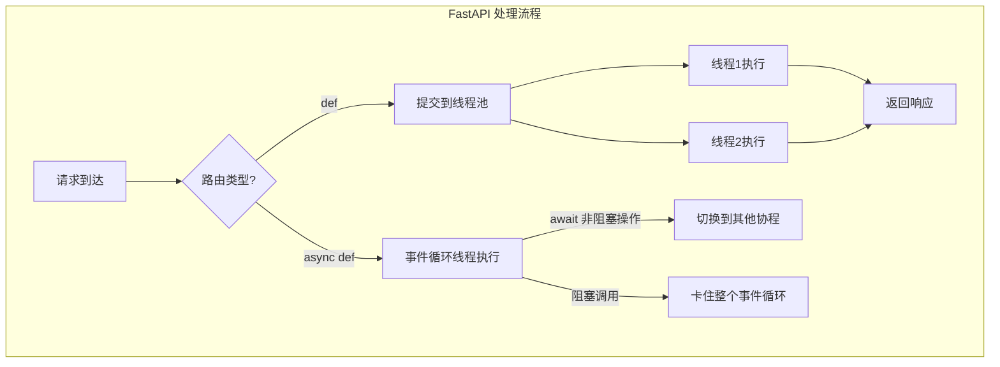

---
kernelspec:
  name: book-venv
  display_name: Python 3 (book)
---

# FastAPI 异步陷阱

学完本节，你能回答：

- 为什么在 `async def` 路由中调用阻塞代码会拖垮整个服务？
- FastAPI 对 `def` 和 `async def` 路由的处理方式有何不同？
- 如何判断一个操作是否“安全”放在异步路由中？
- 当必须使用阻塞代码时，正确的处理方式是什么？

> 接力赛中，选手必须亲手把接力棒交到下一棒手里，如果其中一个选手接过棒之后不撒手，整个赛道的其他队友都得等着。

前一节我们建立了对 asyncio 协作式调度的理解：事件循环在单线程中驱动所有协程，每个协程通过 `await` 主动让出控制权。这个模型高效的前提是——**所有协程都遵守约定，及时让出**。FastAPI 的异步路由跑在同一个事件循环上，如果函数接过棒之后不撒手，比如在 async def 里调用了 time.sleep()。

FastAPI 是一个异步优先的 Web 框架。它允许你用 `async def` 定义路由，也允许用普通的 `def`。但这个选择不是“性能更好”与“性能较差”的区别——用错了，异步版本可能比同步版本慢几十倍。理解二者的差异，是正确使用 FastAPI 的关键。

## 两种路由的处理方式

FastAPI 对 `def` 和 `async def` 路由的处理方式有本质不同。

**`def` 路由（同步）**：FastAPI 不会直接在事件循环中执行它，而是将其提交给一个**外部线程池**，在单独的线程中运行。主事件循环不会被阻塞。

**`async def` 路由（异步）**：FastAPI 直接在事件循环中执行它。所有请求共享同一个事件循环线程。



这个差异决定了什么代码能放在 `async def` 中，什么不能。

## 阻塞调用的代价

在 `async def` 路由中执行阻塞操作，会导致整个事件循环被卡住。以下是三种常见的阻塞操作：

**1. 同步 sleep**

```python
import time

@app.get("/slow")
async def slow_endpoint():
    time.sleep(5)  # 阻塞！整个事件循环卡住 5 秒
    return {"message": "done"}
```

`time.sleep()` 不会让出事件循环。在它执行的 5 秒内，服务器无法处理任何其他请求。

**2. 同步 HTTP 请求**

```python
import requests

@app.get("/fetch")
async def fetch_endpoint():
    response = requests.get("https://api.example.com/data")  # 阻塞！
    return response.json()
```

`requests.get()` 是同步阻塞的。在等待 HTTP 响应期间，事件循环被占用，无法处理其他请求。

**3. 同步数据库操作**

```python
from sqlalchemy.orm import Session

@app.get("/users")
async def get_users(db: Session = Depends(get_db)):
    users = db.query(User).all()  # 阻塞！
    return users
```

SQLAlchemy（同步版本）的查询操作是阻塞的。在查询执行期间，事件循环被占用。

## 实验：阻塞的代价

下面用代码直观展示阻塞调用的影响。

```{code-cell} python
import asyncio
import time

async def non_blocking_task(name: str, delay: float):
    """非阻塞任务：主动让出"""
    print(f"{name} 开始")
    await asyncio.sleep(delay)
    print(f"{name} 结束")
    return name

async def blocking_task(name: str, delay: float):
    """阻塞任务：不让出"""
    print(f"{name} 开始")
    time.sleep(delay)  # 阻塞！不释放事件循环
    print(f"{name} 结束")
    return name

async def main():
    print("=== 非阻塞并发 ===")
    t0 = time.perf_counter()
    await asyncio.gather(
        non_blocking_task("A", 0.3),
        non_blocking_task("B", 0.1),
        non_blocking_task("C", 0.2),
    )
    print(f"非阻塞总耗时: {time.perf_counter() - t0:.3f}s")
    
    print("\n=== 阻塞并发 ===")
    t0 = time.perf_counter()
    await asyncio.gather(
        blocking_task("A", 0.3),
        blocking_task("B", 0.1),
        blocking_task("C", 0.2),
    )
    print(f"阻塞总耗时: {time.perf_counter() - t0:.3f}s")

await main()
```

非阻塞版本三个任务并发执行，总耗时约等于最长的那一个（0.3 秒）。阻塞版本三个任务串行执行，总耗时等于三者之和（0.6 秒）。**在 `async def` 中调用阻塞代码，让“并发”退化为“串行”**。

## 为什么 `def` 路由反而安全

FastAPI 的 `def` 路由运行在线程池中，每个请求在独立的线程中执行。即使某个请求执行了 `time.sleep(5)`，它只阻塞自己的线程，不影响事件循环处理其他请求。

```python
# 运行在线程池中
@app.get("/safe")
def safe_endpoint():
    time.sleep(5)  # 只阻塞当前线程，不影响事件循环
    return {"message": "done"}
```

这也是 FastAPI 官方文档的建议：**如果路由中使用了不支持 `await` 的同步库（如大多数数据库驱动），就用 `def` 而不是 `async def`**。

## 什么时候用 `async def`

`async def` 适合以下场景：

1. **纯计算、不涉及 I/O**：直接返回数据，没有等待
2. **使用异步 I/O 库**：`httpx.AsyncClient`、`asyncpg`、`aiofiles` 等
3. **需要并发执行多个异步操作**：用 `asyncio.gather()` 并行发起多个请求

```python
import httpx
import asyncio

# 使用异步 HTTP 客户端
@app.get("/fast")
async def fast_endpoint():
    async with httpx.AsyncClient() as client:
        response = await client.get("https://api.example.com/data")
    return response.json()

# 并发执行多个异步操作
@app.get("/parallel")
async def parallel_endpoint():
    async with httpx.AsyncClient() as client:
        results = await asyncio.gather(
            client.get("https://api1.example.com"),
            client.get("https://api2.example.com"),
        )
    return [r.json() for r in results]
```

## 当必须使用阻塞代码时

有时你无法避免阻塞代码——老的同步库没有异步版本，或者某个 CPU 密集型计算无法拆分。此时有三种处理方式。

**方式一：改用 `def` 路由（最简单）**

如果路由中大部分操作都是同步的，直接把 `async def` 改成 `def`：

```python
# 从 async def 改为 def
@app.get("/users")
def get_users(db: Session = Depends(get_db)):
    users = db.query(User).all()
    return users
```

FastAPI 会自动将 `def` 路由放入线程池执行。这是最直接的修复方式。

**方式二：使用 `asyncio.to_thread()`（Python 3.9+）**

如果必须在 `async def` 中调用同步函数，可以将其“卸载”到线程池：

```python
import asyncio

@app.get("/process")
async def process_endpoint():
    # 将同步函数卸载到线程池
    result = await asyncio.to_thread(sync_cpu_intensive_work, data)
    return {"result": result}
```

`asyncio.to_thread()` 将同步函数提交给线程池执行，并返回一个可 `await` 的 Future，不会阻塞事件循环。

**方式三：使用 FastAPI 的 `run_in_threadpool`**

FastAPI 内部封装了类似的功能：

```python
from fastapi.concurrency import run_in_threadpool

@app.get("/process")
async def process_endpoint():
    result = await run_in_threadpool(sync_cpu_intensive_work, data)
    return {"result": result}
```

`run_in_threadpool` 与 `asyncio.to_thread()` 类似，将同步函数提交到线程池执行。

## 对比总结

| 路由定义 | 执行位置 | 阻塞调用的影响 | 适用场景 |
|---|---|---|---|
| `def` | 线程池 | 只阻塞当前线程 | 使用同步库、CPU 密集型 |
| `async def`（非阻塞） | 事件循环 | 不阻塞，协程让出 | 使用异步 I/O 库 |
| `async def`（阻塞） | 事件循环 | **卡住整个事件循环** | 永远不要这样做 |

## 本节小结

FastAPI 对 `def` 和 `async def` 路由的处理方式有着本质区别。`def` 路由运行在线程池中，阻塞操作只影响当前线程；`async def` 路由直接在事件循环中执行，任何阻塞操作都会卡住整个服务器。

“异步”不是“自动更快”——在 `async def` 中调用阻塞代码，会让并发退化为串行，甚至比同步版本更慢。正确的做法是：使用异步库时用 `async def`，使用同步库时用 `def`，无法避免的阻塞操作通过 `asyncio.to_thread()` 卸载到线程池。

选择 `async def` 还是 `def`，不是“性能竞赛”而是“类型匹配”——异步路由配异步 I/O，同步路由配同步 I/O。匹配错了，再快的框架也跑不起来。
