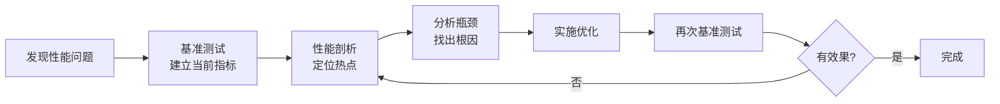
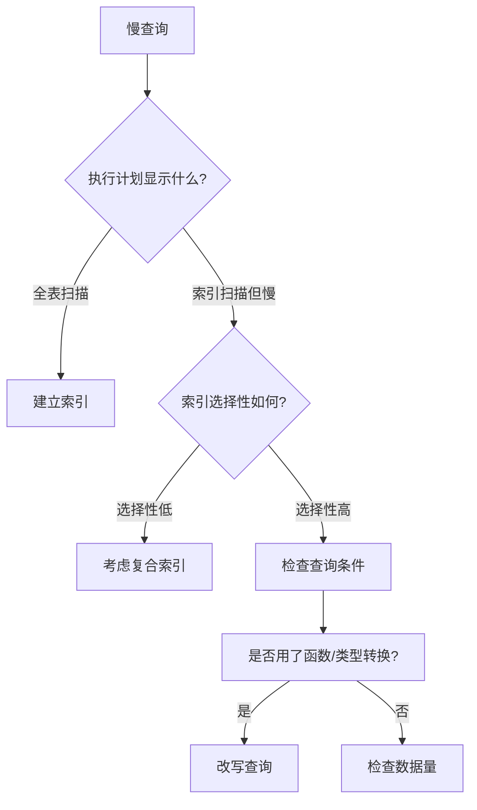
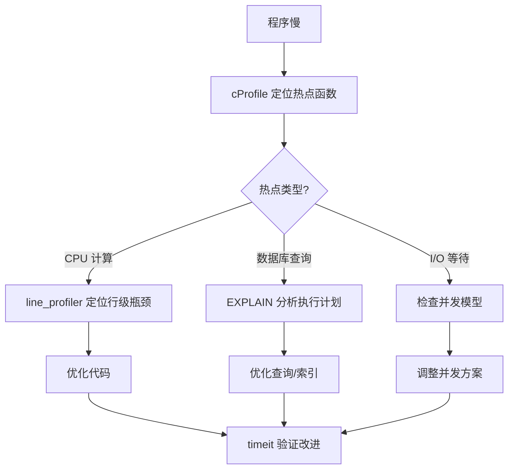

---
kernelspec:
  name: book-venv
  display_name: Python 3 (book)
---

# 性能剖析方法论

学完本节，你能回答：

- 为什么“感觉慢了”不能作为优化的依据？
- `timeit` 和 `cProfile` 分别解决什么问题？各自适用于什么场景？
- 如何定位代码中的性能热点？
- 如何分析数据库查询的慢查询和索引使用情况？

> 没有调查，没有发言权

前四节我们讨论了线程、进程、协程、GIL、异步陷阱，这些都是“写快的工具”。但知道工具怎么用，不等于知道什么时候该用哪个工具。一个常见的错误是：在写代码之前就做“性能预判”，“这里应该用异步”、“那里应该用多进程”，然后把代码改得面目全非，最后发现这些改动对实际性能没有任何影响。

这节讲的是**如何让证据替代猜测**。

## 优化的基本流程

每次性能优化都应遵循同一套流程，而非凭感觉行事。



核心原则：**先度量，再优化，后验证**。没有基准测试的优化是盲人摸象，你根本不知道改了什么、改了之后是好是坏。

## timeit：小片段的精确计时

当你需要对比两段代码谁更快时，`timeit` 是最合适的工具。它自动处理多次运行、环境隔离、结果统计，提供比手动 `time.perf_counter()` 更可靠的测量。

**命令行用法**：

```bash
python -m timeit 'sum(range(1000))'
python -m timeit 'for i in range(1000): pass'
```

**代码内用法**：

```{code-cell} python
import timeit

# 测试列表推导 vs 生成器表达式
list_comp = timeit.timeit('[x*2 for x in range(1000)]', number=1000)
gen_expr = timeit.timeit('list(x*2 for x in range(1000))', number=1000)

print(f"列表推导: {list_comp:.4f}s")
print(f"生成器表达式: {gen_expr:.4f}s")
print(f"差异: {(list_comp / gen_expr):.2f}x")
```

`timeit` 适合回答这类问题：“A 写法比 B 写法快多少？”它的局限性在于只能测量单段代码的执行时间，不能告诉你“这段代码被调用了几次”、“调用者是谁”、“总耗时花在哪里”。

## cProfile：找出程序中的热点

当程序慢的时候，你需要知道的是：**时间花在哪了**。`cProfile` 记录每一次函数调用的次数和耗时，生成一个“热点列表”。

```{code-cell} python
import cProfile
import pstats
import io

def fibonacci(n: int) -> int:
    if n <= 1:
        return n
    return fibonacci(n-1) + fibonacci(n-2)

def compute():
    return [fibonacci(30) for _ in range(5)]

# 运行剖析
profiler = cProfile.Profile()
profiler.enable()
compute()
profiler.disable()

# 输出统计结果
stream = io.StringIO()
stats = pstats.Stats(profiler, stream=stream)
stats.strip_dirs().sort_stats('cumtime').print_stats(10)
print(stream.getvalue())
```

`cProfile` 输出的关键指标：

| 列 | 含义 | 用途 |
|---|---|---|
| `ncalls` | 调用次数（包含递归） | 找到高频调用 |
| `tottime` | 函数自身总耗时（不含子调用） | 找到单次耗时长的函数 |
| `cumtime` | 函数自身 + 子调用的总耗时 | 找到整个调用链的瓶颈 |
| `percall` | 每次调用的平均耗时 | 判断是否为单次慢 |

解读 `cProfile` 输出时，关注两个方向：

- **`tottime` 高**：这个函数本身慢，优化函数内部逻辑
- **`ncalls` 高**：这个函数被调用了太多次，减少调用次数或使用缓存

## 数据库查询分析：更常见的瓶颈

Web 应用最典型的性能瓶颈是数据库查询。慢查询往往不是代码写得差，而是 SQL 没有走索引。

**1. ORM 日志：找到生成了什么 SQL**

大多数 ORM 可以配置日志输出实际执行的 SQL：

```python
# SQLAlchemy 配置日志
import logging
logging.basicConfig()
logging.getLogger('sqlalchemy.engine').setLevel(logging.INFO)

# Django 配置
# settings.py
LOGGING = {
    'loggers': {
        'django.db.backends': {'level': 'DEBUG'},
    }
}
```

**2. EXPLAIN：诊断慢查询**

找到慢查询后，用 `EXPLAIN` 查看数据库的执行计划：

```sql
EXPLAIN ANALYZE
SELECT * FROM orders 
WHERE user_id = 123 
  AND created_at > '2026-01-01'
  AND status = 'paid';
```

关键观察：

| 指标 | 含义 | 理想值 |
|---|---|---|
| `Seq Scan` | 全表扫描 | 应改为索引扫描 |
| `Index Scan` | 索引扫描 | 好 |
| `rows` | 扫描的行数 | 尽可能小 |
| `cost` | 执行代价估算 | 尽可能小 |

**3. 索引设计原则**



常见索引陷阱：

```sql
-- 索引失效：在索引列上使用函数
SELECT * FROM orders WHERE DATE(created_at) = '2026-01-01';
-- 改为区间查询
SELECT * FROM orders WHERE created_at >= '2026-01-01' AND created_at < '2026-01-02';

-- 索引失效：隐式类型转换
SELECT * FROM orders WHERE user_id = '123';  -- user_id 是 int
-- 类型匹配
SELECT * FROM orders WHERE user_id = 123;

-- 索引失效：使用 != 或 LIKE '%keyword'
SELECT * FROM orders WHERE status != 'cancelled';
SELECT * FROM orders WHERE user_name LIKE '%张三%';
```

## 行级剖析与精细化定位

`cProfile` 是函数级别定位热点的方法。有时瓶颈不在函数入口，而在函数内部的某几行代码。**`line_profiler`** 提供了按行计时的能力。

```{code-cell} python
# 安装: uv add --dev line-profiler
import time

def process_data(data):
    # 假设这是热点函数
    time.sleep(0.01)
    result = []
    for item in data:
        # 这可能是真正的瓶颈
        processed = item * 2
        result.append(processed)
    time.sleep(0.01)
    return result
```

```bash
# 需要在函数上添加 @profile 装饰器，然后运行
kernprof -l -v script.py
```

输出示例：

```
Line #      Hits         Time  Per Hit   % Time  Line Contents
==============================================================
    5          1      10000.0  10000.0     50.0      time.sleep(0.01)
    6          1          1.0      1.0      0.0      result = []
    7      10000      10000.0      1.0     50.0      for item in data:
    8      10000      10000.0      1.0     50.0          processed = item * 2
    9      10000      10000.0      1.0     50.0          result.append(processed)
   10          1      10000.0  10000.0     50.0      time.sleep(0.01)
```

`line_profiler` 的核心价值在于确认猜测：当 `cProfile` 告诉你某个函数慢，你可以用 `line_profiler` 找出函数内部具体慢在哪一行。

## 优化流程

基于上述工具，一套完整的优化流程是：

1. **`timeit`**：小段代码的精确计时。用于对比不同写法的性能差异，或验证优化后的单点改进效果。
2. **`cProfile`**：全程序的热点定位。用于找出“整个程序的时间花在哪了”。
3. **`EXPLAIN`**：数据库慢查询分析。用于诊断“SQL 为什么慢”。
4. **`line_profiler`**：行级精细化定位。用于在热点函数内部找出具体慢在哪一行。



## 本节小结

性能优化的前提是度量。没有数据支撑的优化是在黑暗中开枪，你可能打中目标，更可能浪费子弹。`timeit` 提供小片段的精确计时，适合对比不同的写法和验证优化效果；`cProfile` 提供全程序的函数级热点定位，回答“时间花在哪了”；`EXPLAIN` 分析数据库慢查询的执行计划和索引使用情况，这是 Web 应用中最常见的瓶颈来源；`line_profiler` 在热点函数内部逐行定位，回答“具体是哪一行慢”。四者配合，构成从宏观到微观的完整度量体系。
