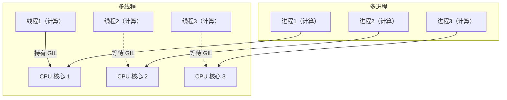

---
kernelspec:
  name: book-venv
  display_name: Python 3 (book)
---

# Python GIL 真相

学完本节，你能回答：

- GIL 是什么？它为什么存在？
- 为什么 CPython 的多线程无法利用多核执行 CPU 密集型计算？
- GIL 在什么场景下是瓶颈，什么场景下不是？
- 如何用实测数据判断你的任务该用线程还是进程？

> 只有一个收银台的超市，顾客（线程）选购商品（I/O 操作）时可以同时穿梭货架，但到了结账（CPU 计算）时，必须排队一个一个来。所以，如果大家都在挑东西（等待网络、读写文件），收银台不是瓶颈；但如果每个人扎堆结账，队伍就堵死了，再多收银员（核心）也帮不上忙。

前一节我们通过计时器看到：三个 50 毫秒的 I/O 任务，用线程可以实现约 50 毫秒完成，而串行需要约 150 毫秒。这一结果似乎暗示“多线程能加速任务执行”——但这个结论是有前提的。如果我们把 I/O 任务换成 CPU 计算任务，同样的线程模型会给出截然不同的结果。理解这个差异，需要引入一个 CPython 的核心机制：GIL。

## GIL 是什么

**GIL（Global Interpreter Lock，全局解释器锁）** 是 CPython 解释器中的一个互斥锁。它的规则很简单：**同一时刻，只有一个线程能执行 Python 字节码**。

这意味着，无论你的机器有多少个 CPU 核心，在 CPython 中，多个线程无法真正并行执行 Python 代码。它们可以在 I/O 等待时交替运行，但不能同时在两个核心上执行计算。

GIL 的存在是 CPython 内存管理机制的产物。CPython 使用引用计数来管理对象生命周期，每个 Python 对象都有一个计数器，记录有多少引用指向它。当引用计数变为 0 时，对象被立即释放。如果多个线程同时修改同一个对象的引用计数，计数器的更新操作会相互干扰，导致对象被错误释放或永远无法释放。GIL 通过保证同一时刻只有一个线程执行字节码，从根本上消除了这种竞争——解释器状态始终是线程安全的。

## GIL 的代价

GIL 的核心代价是：**Python 线程无法利用多核执行 CPU 密集型计算**。



左图：多个线程共享同一个 GIL，只能在一个核心上执行。
右图：多个进程各有独立的解释器和 GIL，可以在多个核心上并行执行。

但 GIL 并不总是瓶颈。当线程执行 I/O 操作（网络请求、文件读写、数据库查询）时，它会在等待操作完成时释放 GIL，让其他线程有机会执行。此时线程切换的开销远小于 I/O 操作的耗时，因此多线程可以显著提升 I/O 密集型任务的吞吐量。

## 实测：CPU 密集型任务

下面用实际代码验证 GIL 对 CPU 密集型任务的影响。

```{code-cell} python
import time
import threading
from multiprocessing import Pool

def cpu_work(n: int) -> int:
    """CPU 密集型计算：计算平方和"""
    total = 0
    for i in range(n):
        total += i * i
    return total

def run_serial(n: int, repeat: int = 4) -> float:
    """串行执行"""
    t0 = time.perf_counter()
    for _ in range(repeat):
        cpu_work(n)
    return time.perf_counter() - t0

def run_threading(n: int, repeat: int = 4) -> float:
    """多线程执行"""
    threads = []
    results = [0] * repeat

    def _worker(idx: int):
        results[idx] = cpu_work(n)

    t0 = time.perf_counter()
    for i in range(repeat):
        t = threading.Thread(target=_worker, args=(i,))
        threads.append(t)
        t.start()
    for t in threads:
        t.join()
    return time.perf_counter() - t0

def run_multiprocessing(n: int, repeat: int = 4) -> float:
    """多进程执行"""
    t0 = time.perf_counter()
    with Pool(processes=repeat) as pool:
        pool.map(cpu_work, [n] * repeat)
    return time.perf_counter() - t0
```

```{code-cell} python
n = 5_000_000
repeat = 4

t_serial = run_serial(n, repeat)
t_thread = run_threading(n, repeat)
t_mp = run_multiprocessing(n, repeat)

print(f"串行耗时: {t_serial:.3f}s")
print(f"多线程耗时: {t_thread:.3f}s")
print(f"多进程耗时: {t_mp:.3f}s")
print(f"多进程 / 串行: {t_mp / t_serial:.2f}x")
```

多线程耗时与串行相近，甚至略慢（线程创建和切换开销）；多进程耗时为串行的 1/核数 左右。**对于 CPU 密集型任务，多线程没有加速效果，多进程才能利用多核。**

## 实测：I/O 密集型任务

同样的机器，换成 I/O 密集型任务，结果截然不同。

```{code-cell} python
import time
import threading
from multiprocessing import Pool

def io_work(delay: float = 0.1) -> None:
    """I/O 密集型任务：模拟等待"""
    time.sleep(delay)

def run_serial_io(repeat: int = 10, delay: float = 0.1) -> float:
    t0 = time.perf_counter()
    for _ in range(repeat):
        io_work(delay)
    return time.perf_counter() - t0

def run_threading_io(repeat: int = 10, delay: float = 0.1) -> float:
    threads = []
    t0 = time.perf_counter()
    for _ in range(repeat):
        t = threading.Thread(target=io_work, args=(delay,))
        threads.append(t)
        t.start()
    for t in threads:
        t.join()
    return time.perf_counter() - t0

def run_multiprocessing_io(repeat: int = 10, delay: float = 0.1) -> float:
    t0 = time.perf_counter()
    with Pool(processes=repeat) as pool:
        pool.map(io_work, [delay] * repeat)
    return time.perf_counter() - t0
```

```{code-cell} python
repeat = 10
delay = 0.1

t_serial = run_serial_io(repeat, delay)
t_thread = run_threading_io(repeat, delay)
t_mp = run_multiprocessing_io(repeat, delay)

print(f"串行耗时: {t_serial:.3f}s")
print(f"多线程耗时: {t_thread:.3f}s")
print(f"多进程耗时: {t_mp:.3f}s")
```

串行约 1.0 秒，线程和进程都约 0.1 秒。**对于 I/O 密集型任务，线程和进程都有显著加速，且二者差异不大。** 此时应优先选择线程——开销更低、共享内存更方便。

## GIL 的边界

把两次实测结果放在一起：

| 任务类型 | 串行 | 多线程 | 多进程 | 结论 |
|---|---|---|---|---|
| CPU 密集型 | 基准 | 相近或更慢 | 显著加速（≈ 核数倍） | GIL 是硬瓶颈 |
| I/O 密集型 | 基准 | 显著加速 | 显著加速 | GIL 不是瓶颈 |

GIL 是否成为瓶颈，不取决于你用的是线程还是进程，而取决于**线程在持有 GIL 时做什么**。

- **I/O 密集型**：线程在等待 I/O 时释放 GIL，其他线程可以执行。GIL 的持有时间短，切换频繁，多线程有效。
- **CPU 密集型**：线程长时间持有 GIL 进行计算，其他线程无法执行。GIL 成为串行化的瓶颈，多线程无效。

## GIL 会被移除吗

这是 Python 社区一个经久不衰的问题。GIL 被移除的可能性极低，原因有三：

**1. 兼容性**。Python 有大量 C 扩展（NumPy、Pandas、TensorFlow 等）依赖 GIL 来保证线程安全。移除 GIL 需要重写这些扩展，工作量巨大。

**2. 单线程性能**。无 GIL 的解释器（如曾经尝试过的 `python-sans-gil` 分支）通常会在单线程场景下引入额外的性能开销——为了替代 GIL 的粗粒度锁，需要引入大量细粒度锁，这会降低单线程代码的执行效率。Python 生态中大量代码是单线程的，为多线程场景牺牲单线程性能，代价过高。

**3. 存在替代方案**。对于需要并行计算的场景，`multiprocessing`、C 扩展（释放 GIL）、NumPy 等工具已经提供了实用路径。移除 GIL 的必要性不如想象中迫切。

## 本节小结

GIL 是 CPython 为保护内存安全而引入的全局锁，它让同一时刻只有一个线程能执行 Python 字节码。对于 CPU 密集型任务，GIL 是硬瓶颈——多线程无法利用多核，必须使用多进程。对于 I/O 密集型任务，GIL 在等待期间被释放，多线程能够有效重叠等待时间，是轻量且高效的选择。

GIL 不是 Python 的“设计缺陷”，而是 CPython 实现中一项经过权衡的工程决策。它保护了 C 扩展的兼容性，保障了单线程代码的执行效率，代价是多线程无法并行执行 CPU 计算。理解这一边界，才能准确判断何时用线程、何时用进程、何时该把计算交给 NumPy 或 C 扩展。
