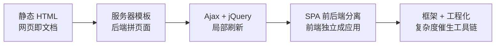

---
kernelspec:
  name: book-venv
  display_name: Python 3 (book)
---

# 前端从哪来

学完本节，你能回答：

- 为什么说前后端分离是被复杂度与职责演进推出来的结果，而不是一次技术选型的灵光一现？
- 从静态页面到 SPA，前端走过哪几个阶段？每个阶段解决了什么、留下了什么债？
- 分离之后，后端守什么、前端守什么？这条边界为什么是协作的前提？
- 接口契约具体是什么？它和后端的 RESTful API、OpenAPI 是什么关系？

> 前端的演进像一家餐厅从一个人既炒菜又跑堂到后厨与前厅分工的过程。最早店里只卖一种套餐，菜单印死了，谁来都是同一盘；后来客人要按自己的口味点菜，厨师只能现炒现端、连摆盘一起上；再后来客人太多、口味太杂，老板才想明白：后厨只管出锅的半成品，前厅专门按每位客人的要求现摆盘，那张菜单成了两边唯一要对齐的东西。前端这个工种，正是在这场分工里被逼出来的。

前六章讲的都是服务器那一侧的功夫：路由怎么分、数据怎么验、表怎么建、并发怎么扛。但产品最终落在用户屏幕上的不是服务器日志里的 JSON，而是一个能点、能输入、能刷新的页面。要理解前端这个角色，得先回答一个更基本的问题：它从哪来？

这个角色不是谁拍脑袋发明出来的。它是在解决一个又一个具体问题的过程中，一步步被逼出来的。把这条演进脉络走一遍，后面每一节“为什么”就都有了出处。

## 五个阶段，五笔旧账



### 静态页面

网页诞生之初，并没有前端和后端之分，只有写死的 HTML 文件。每一个页面就是一个 `.html` 文件，浏览器请求到什么就原样显示什么，谁来访问看到的都是同一份内容。页面之间的跳转，靠的是超链接。

```html
<!-- 阶段一：写死的 HTML，谁来访问都是同一份 -->
<html>
  <body>
    <h1>2024 年 1 月例会纪要</h1>
    <p>一、项目排期讨论……</p>
  </body>
</html>
```

它解决了“把文档搬上网”的问题，也留下了第一笔债：内容和页面焊死在一起，改一个错别字都要改文件、重新上传。这个阶段的页面没有状态，也没有交互，说白了，它是披着网页外衣的文档。

### 服务器模板

内容要千人千面，写死的文件就不够用了。

后端程序从数据库取出数据，填进模板引擎，拼成一段完整的 HTML 一次性返回。JSP、PHP、Jinja2 都是这个时代的产物：页面里既有 HTML 骨架，也有被后端填充的变量占位。

```html
<!-- 阶段二：服务器模板，后端填数据后返回完整 HTML（Jinja2 示意） -->
<ul>
  
    <li>{{ task.title }} · {{ task.status }}</li>
  
</ul>
```

它解决了“同一套页面显示不同数据”的问题，也留下了第二笔债：页面和业务逻辑耦合在后端。任何一次交互都要整页刷新，改一个前端样式也可能牵动后端代码。后端工程师从此被迫既写业务，也拼页面，两个人做一件事，注定有人做不好。

### Ajax 与 jQuery

XMLHttpRequest 的诞生是一个转折点：浏览器不必刷新整个页面，就能在后台请求数据、更新页面的某一块。jQuery 把选中元素、改样式、绑事件这套繁琐的原生 DOM 操作简化到极致，一度成了前端的代名词。

```javascript
// 阶段三：Ajax 局部刷新，改列表不重载整页（示意）
$.get('/api/search?q=pydantic', function (results) {
  const html = results.map(r => `<li>${r.title}</li>`).join('')
  $('#result-list').html(html)   // 只更新列表这一块
})
```

它解决了“交互非要整页刷新”的痛点，也留下了第三笔债：JavaScript 直接操作 DOM，逻辑散落在事件回调与选择器里，代码规模一大就成了难以维护的面条代码。当数据变了和页面要跟着变之间的手工同步越来越复杂，框架的登场就只是时间问题。

### SPA 与前后端分离

数据变化 → 视图更新的手工同步终于难以为继。业界干脆把渲染整件事交给浏览器：后端只返回 JSON 数据，前端用一个 JavaScript 应用把数据渲染成页面，页面跳转由前端路由管理。单页应用（SPA）成为主流，Angular、React、Vue 相继登场，前端第一次以应用而非页面增强的身份出现。

```javascript
// 阶段四：SPA 前后端分离，前端接管渲染（示意）
const res = await fetch('/api/search?q=pydantic')
const results = await res.json()
render(results)   // 前端把 JSON 渲染成整个应用的视图
```

它解决了职责分离、多端复用、前后端并行交付的问题，也留下了第四笔债：首屏需要额外的请求与等待，SEO 需要 SSR 或预渲染兜底，前端自身也第一次背负了应用应有的复杂度。它不再是“给页面加点交互”，而是一个独立的应用。

### 框架与工程化

当渲染交给浏览器，前端代码的规模、依赖与构建复杂度第一次超过了手写就够的临界：状态怎么管理、组件怎么拆分、依赖怎么安装、源码如何变成浏览器能跑的静态资源。React / Vue / Angular 管状态如何变成视图，Node.js / npm / ES Module 这套工具链管构建与分发。

```javascript
// 阶段五：框架接管状态 → 视图（Vue 3 示意）
import { ref, computed } from 'vue'
const results = ref([])
const pydanticCount = computed(() => results.value.filter(r => r.source.includes('pydantic')).length)
```

它让状态到视图、构建到部署第一次有了章法，也留下了第五笔债：从业者要面对一整条陌生的工具链和陡峭的学习成本。这正是本章后续各节要逐一展开的内容。

| 阶段 | 谁渲染页面 | 解决了什么 | 留下的债 |
| --- | --- | --- | --- |
| 静态 HTML | 写死的文件 | 文档上网 | 内容与页面焊死 |
| 服务器模板 | 后端拼 HTML | 内容千人千面 | 页面与业务耦合、整页刷新 |
| Ajax + jQuery | 浏览器局部改 DOM | 交互免刷新 | DOM 面条代码 |
| SPA 前后端分离 | 前端 JS 应用 | 职责分离、多端复用、并行交付 | 首屏与 SEO 成本、应用复杂度 |
| 框架 + 工程化 | 框架与构建链 | 状态到视图、构建到部署有章法 | 一整条工具链与学习成本 |

这五个阶段不是后者淘汰前者，而是每一阶段都为下一阶段提供了痛点。主线始终是同一件事：把“谁能更好地把数据变成页面”这件事，一步步交给更合适的那一侧。后端开发者不必成为前端专家，但认得出这段演进，就能理解为什么今天前端有独立的框架、独立的包管理、独立的构建流程，而不再只是一堆散落在 HTML 里的 `script` 标签。

## 分离之后

分离不是后端没事做了，而是两边各自守住一条清晰的边界，再靠一份契约对齐。

| 关注点 | 后端 | 前端 |
| --- | --- | --- |
| 数据 | 从哪来、怎么存、怎么校验 | 怎么变成页面 |
| 逻辑 | 业务规则 | 交互反馈、状态流转 |
| 对外承诺 | 接口契约（路径、形状、状态码） | 用户体验 |
| 边界原则 | 契约之内是我的责任 | 契约之外是你的自由 |

### 契约

契约就是后端对外承诺的那份接口规范。后端暴露接口通常遵循一套约定，即 RESTful API：每个接口由资源路径 + HTTP 方法 + 状态码三样东西共同确定。例如 `GET /api/search?q=...` 表示搜索文档，`POST /api/favorites` 表示收藏，删除成功返回 `204`。为了让这份规范机器可读、可校验、可自动生成文档和客户端代码，业界用 OpenAPI 把它写成一份结构化描述：

```yaml
# OpenAPI 片段：GET /api/search 的契约（示意）
paths:
  /api/search:
    get:
      summary: 搜索文档
      responses:
        '200':
          description: 返回文档数组
```

契约同时锁定了路径、请求与响应形状、状态码。它一旦确定，前端可以照着它生成类型、写 mock、先行开发，后端可以照着它写测试，双方无需看到对方的代码即可并行推进。RESTful 与 OpenAPI 的完整细节已经在 HTTP 与 RESTful 一章展开，这里只需记住：契约是前后端协作里最值钱的那一个词，它是边界得以成立的技术载体。

## 本节小结

- 前端不是被发明出来的，而是被复杂度逼出来的：从静态页面一路演进到 SPA，动力是交互复杂度、多端复用与并行交付三重压力。
- 每一阶段都在解决上一阶段的问题，同时为下一阶段埋下债；认得出这段演进，才能理解后文每个工具的来源。
- 分离之后，后端守业务与数据，前端守渲染与交互，接口契约是两边唯一的交汇点。
- 契约落到具体就是 RESTful API（路径、方法、状态码）与 OpenAPI（机器可读的接口描述），它让并行开发成为可能。
- 工程化之所以必要，是因为前端独立成应用后，代码规模与构建复杂度第一次超过了手写就够的临界。

