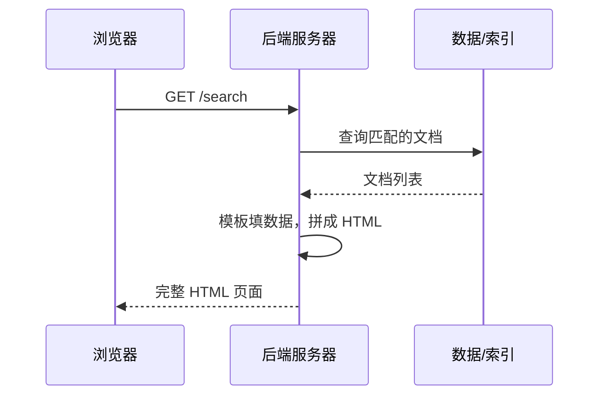
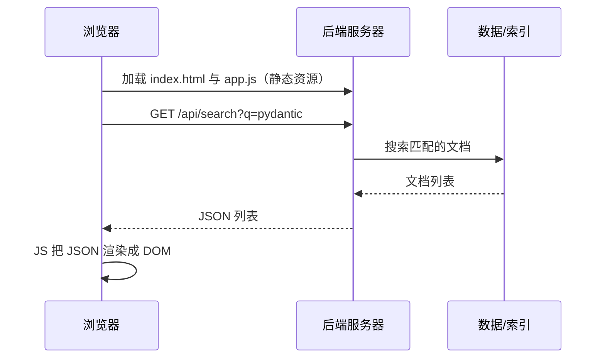
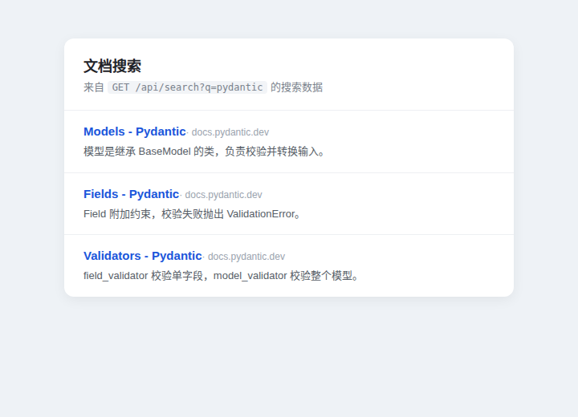

---
kernelspec:
  name: book-venv
  display_name: Python 3 (book)
---

# 前端在架构中的角色

学完本节，你能回答：

- 谁来渲染 HTML 这个看似细枝末节的问题，如何决定整条链路的职责与协作方式？
- 后端模板渲染与前后端分离，在职责、URL 与产物上的本质差异是什么？
- 接口契约是什么？它如何让前后端在没有对方在场的情况下并行开发？
- 面对一个具体的页面，你根据什么判断它该走模板直出还是前后端分离？

上一节看到，前端是在从静态页面到 SPA 的演进里被复杂度逼出来的独立角色。这一节把镜头拉近到分离之后：一个页面到底该由谁拼出来、边界怎么划、划错了会发生什么。

> 同样一篇新闻，一种做法是报社把稿件排版、印刷、装订成册，读者拿到手就是最终形态；另一种做法是报社只供稿件，读者用自己的阅读器按喜好排版渲染。同一篇内容，只是排版这件事从印厂移到了读者手里。后端模板渲染像前者，前后端分离像后者。

本节把分离这个抽象判断，落成三个后端工程师在协作里必须先谈明白的问题：谁渲染 HTML、URL 怎么分、接口契约怎么定。把这三个问题谈清楚，一半以上的联调翻车都能提前避免。

## 谁来渲染 HTML

对于前后端开发而言，语法很重要，但是没那么重要，浏览器需要解析 HTML 到底在哪里被组装出来更重要一些。这个问题的答案一直伴随着整个前后端开发变化而变化，过去是模板渲染，现在这个职责归前端了。

### 后端模板渲染

后端模板渲染把拼 HTML 这件事放在服务器。浏览器请求一个 URL，后端从数据库取数据、填进模板、拼成完整的 HTML 一次性返回。



它的优点是首屏直出、SEO 友好、前端复杂度低，适合内容型页面；代价是每次交互都可能整页刷新，前后端耦合在同一套代码与模板里，难以独立部署与演进。典型栈是 JSP、PHP、Jinja2。

### 前后端分离

前后端分离把渲染交给浏览器。后端只负责返回 JSON，前端用 JavaScript 把数据渲染成 DOM。



它的优点是前后端可独立开发、部署与演进，交互流畅（局部更新、无需整页刷新），接口可同时服务 Web、App、小程序；代价是首屏需要额外一次数据请求，SEO 需要 SSR 或预渲染兜底，且需要一份明确的接口契约。典型栈是 Vue / React 加 FastAPI / Express。

### 两者对比

| 维度 | 后端模板渲染 | 前后端分离 |
| --- | --- | --- |
| 渲染位置 | 服务器 | 浏览器 |
| 后端产物 | HTML | JSON |
| 首屏体验 | 直出，快 | 需再请求一次数据 |
| SEO | 天然友好 | 需 SSR / 预渲染 |
| 交互 | 整页刷新为主 | 局部更新，流畅 |
| 部署 | 前后端耦合，一起发布 | 可独立部署演进 |
| 多端复用 | 接口被页面绑定 | 接口服务 Web / App 等多端 |

两种形态都能交付同一个页面，但"谁对页面负责"不同。选型跟着需求走：内容型、SEO 强依赖的官网适合模板直出；交互密集、需多端复用的应用更适合前后端分离。

## 页面路由与接口路由

谁来渲染 HTML 的答案，直接决定了 URL 的归属。以文档搜索为例，看两类 URL 各归哪一方。

后端模板渲染下，URL 既是页面地址又是数据查询：`GET /search` 直接返回一个填好搜索结果的 HTML 页面，接口与页面混在同一张路由表里。

前后端分离下，URL 分成两类，各归一方。前端代码负责把页面路由与接口路由配合起来：

```javascript
// 前端：页面路由 /search 归前端控制，数据来自接口路由 /api/search?q=...
async function search(keyword) {
  const res = await fetch(`/api/search?q=${keyword}`)   // 接口路由，归后端
  const data = await res.json()
  render(data)                                           // 前端把 JSON 渲染成页面
}
```

后端只提供接口路由，不再拼页面：

```python
# 后端：FastAPI 路由，只提供接口、不渲染页面
from fastapi import FastAPI

app = FastAPI()

@app.get("/api/search")
def search(q: str):
    # 这里调用搜索服务（第 10 章外部集成会展开），此处只返回形状
    return [{"title": "Models - Pydantic", "url": "https://docs.pydantic.dev/", "source": "docs.pydantic.dev"}]
```

两种路由的分工总结如下：

| 路由类型 | 归属 | 例子 | 返回 |
| --- | --- | --- | --- |
| 页面路由 | 前端 | `/search` | 由前端路由决定渲染哪个页面 |
| 接口路由 | 后端 | `/api/search?q=...` | JSON 数据 |

两者用统一前缀（如 `/api`）区分，避免歧义。这种划分让协作更清晰：后端在 OpenAPI 里定义输入、输出形状与状态码，前端据此渲染；任何一方改动，都先回到契约，再改实现。

## 接口契约

契约是前后端之间那份共同文件，双方不知道对方怎么实现，也能并行推进。上一节说过，它最少锁定三样东西：路径、请求与响应形状、状态码。下面是一份最小契约的示意：

```json
// GET /api/search?q=pydantic 的响应形状（示意）
[
  {
    "title": "Models - Pydantic",
    "url": "https://docs.pydantic.dev/latest/concepts/models/",
    "source": "docs.pydantic.dev",
    "content": "模型是继承 BaseModel 的类……"
  }
]
```

契约一旦确定，前端就能拿着这份形状做开发：数据没来之前渲染加载中，数据到了渲染结果，数据为空渲染空态，请求失败渲染错误与重试。这几种状态统称三态渲染，它是前端对接任何接口时的标准姿态。



上图是一个文档搜索页在前端渲染出的样子：后端只返回了上一段那样的 JSON，是前端把它变成了一个能看的页面。这正是前后端分离分工的结果。

## 选型判断

回到开头的判断题：一个页面该走模板直出还是前后端分离，看三件事就能判断。

- **交互密度**：搜索、筛选、实时更新这类频繁局部变更的场景，前后端分离的局部更新能力更合适；内容型页面模板直出更省事。
- **多端复用**：接口要同时服务 Web、App、小程序时，分离形态让后端只维护一份接口，各端各自消费。
- **交付节奏**：前端拿契约先行开发、后端照契约测试，分离形态能把两拨人的工期叠起来并行推进。

边界不是绝对的，但跟着这三条判断走，绝大多数场景不会走错。

## 本节小结

- 谁来渲染 HTML 决定了职责、URL 与协作方式的全部走向。
- 后端模板渲染把页面放在服务器拼，前后端分离把页面放在浏览器拼。一个出 HTML，一个出 JSON，各有代价，选型要跟着场景走。
- URL 归属跟着渲染位置走：分离之后页面路由归前端、接口路由归后端，用 `/api` 前缀把两者分开。
- 接口契约锁定路径、形状与状态码，是前后端并行开发的交汇点。前端据此做加载、空态、错误三态渲染，后端据此写测试。边界画得清，协作才不乱。
