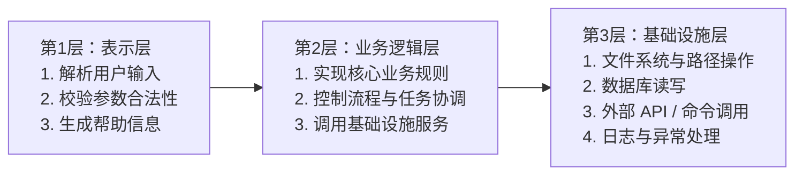

---
kernelspec:
  name: book-venv
  display_name: Python 3 (book)
---

# Python 自动化脚本

学完本节，你能回答：

- 什么时候该用 Python 写脚本，而不是 Shell？
- 怎样组织脚本代码，让它既可运行又可测试？
- 四个核心模块（`argparse`、`pathlib`、`shutil`、`subprocess`）各自解决什么问题？
- 工程级脚本要具备哪些设计要素（`--dry-run`、阈值确认、配置外部化）？

> 工程中的重复劳动易错、难复现。Python 脚本的价值在于把"操作"变成"代码"，减少重复劳动对人的摧残。

Shell 脚本擅长调用命令、搬运文件、拼接文本流，它是系统层面的“胶水”，在进程和文件之间穿针引线。但业务层面的自动化，往往需要解析 JSON、调用 API、处理日期时间、读写数据库、校验数据合法性、发送通知……这些场景一旦涉及条件分支、数据结构、异常处理，Shell 脚本的可读性和可维护性就会急剧下降。Python 的优势在于：它是一门通用编程语言，拥有完整的标准库和生态，既能像 Shell 一样调用系统命令，也能用同一种语法处理文件、网络、数据结构和业务逻辑。学习用 Python 写自动化脚本，本质上是把“靠命令行拼凑的一次性操作”，升级为程序，深入业务实处。

---

## 为什么用 Python 写脚本，而不是 Shell？

Shell 脚本适合短小的"胶水"任务——把几个命令串起来，用管道传递文本。但当任务变得复杂时，Shell 的局限就会暴露出来：

**1. 可移植性：同一段脚本，三台机器三种结果**

Shell 依赖外部命令（`cp`、`mv`、`find`、`sed`），不同系统的命令参数和行为有细微差异。一个在 Ubuntu 上跑得好好的脚本，放到 macOS 上可能因为 `find` 的 `-maxdepth` 参数不被支持而报错。而 Python 的 `pathlib` / `shutil` / `subprocess` 行为一致，不受操作系统影响。

**2. 错误处理：Shell 只能"全或无"**

Shell 脚本的 `set -e` 让脚本在任意错误时退出，但错误信息往往只有一行号，难以定位。如果要区分"文件不存在"和"权限不足"，需要手动检查 `$?` 并做分支判断，代码很快变得臃肿。Python 的异常机制可以精确捕获不同错误类型，做精细化处理。

**3. 复杂逻辑：Shell 的语法是"写着写着就忘了怎么写了"**

当脚本超过 50 行，分支、循环、数组、字符串处理交织在一起时，Shell 的语法（`[ $? -eq 0 ]`、`for i in $(cat list)`、`${var#prefix}`）会让可读性急剧下降。Python 的语法更接近自然语言，易于维护和 Review。

**4. 可测试性：Shell 脚本很难写单元测试**

Shell 脚本的测试方式通常是"跑一遍，看输出对不对"。要模拟文件不存在、权限不足、磁盘满等场景，几乎不可能自动化。而 Python 脚本可以把业务逻辑抽成纯函数，用 `pytest` + `tmp_path` fixture 轻松模拟各种场景。

超过 20 行，或需要分支、循环、参数校验、错误处理的自动化任务，一律用 Python。

---

## 一个真实的工程脚本：Excel 驱动的文件同步

假设你是某大型工厂的资料统计员。厂里正在进行知识库建设——各车间、各岗位的操作手册、设备图纸、检修记录、培训课件，需要统一归类造册，做成一份可检索的电子档案。

你的日常工作是这样的：

**第一步**：各个车间把资料以纸质或电子形式交上来，你整理成电子文件，按规范命名后存到电脑上对应的文件夹里：

```
资料收集/
├── 化肥生产一部/
│   ├── 操作规程/
│   │   ├── 主控岗位/
│   │   │   ├── 2026年大修操作票.docx
│   │   │   └── 开工方案.pdf
│   │   └── 巡检岗位/
│   │       └── 压缩机巡检记录表.xlsx
│   └── 设备图纸/
│       └── 压缩机/
│           └── 压缩机剖面图.pdf
└── 化肥生产二部/
    ├── 安全规程/
    │   └── 受限空间作业指南.pdf
    └── 操作规程/
        └── 合成岗位/
            └── 合成气操作规程.pdf
```

**第二步**：你把这些文件的元信息——文件名、所属单位、资料类别、岗位、存储位置——录入到 Excel 表格里，形成一份"档案目录"：

| 文件名 | 生产单位 | 车间 | 资料类别 | 岗位 | 存储位置 |
|--------|---------|---------|---------|------|---------|
| 2026年大修操作票.docx | 化肥生产一部 | 合成 | 操作规程 | 主控 | 资料收集/化肥生产一部/操作规程/主控岗位/2026年大修操作票.docx |
| 压缩机剖面图.pdf | 化肥生产一部 | 合成 | 设备图纸 | - | 资料收集/化肥生产一部/设备图纸/压缩机/压缩机剖面图.pdf |
| 受限空间作业指南.pdf | 化肥生产二部 | 合成 | 安全规程 | - | 资料收集/化肥生产二部/安全规程/受限空间作业指南.pdf |

**Excel 是"档案目录"，磁盘是"实体仓库"——二者必须保持严格一致。**

但现实是混乱的：

- 有些文件从别的部门拷贝过来，文件名包含乱码或日期后缀（`大修操作票_final.docx`、`大修操作票_备份.docx`），和 Excel 对不上
- 有人直接把文件放到了错误的文件夹，但 Excel 里记录的是正确位置
- 有文件被移走了，Excel 里还在
- 更常见的是：有人往文件夹里扔了一个新文件，但 Excel 里没有登记

**结果就是：Excel 说"文件在 A 位置"，实际文件在 B 位置；Excel 说"有这个文件"，磁盘上找不到；磁盘上有一堆文件，Excel 里没登记——档案目录和实体仓库脱节了。**

你每个月都要花一整天手工对齐：打开 Excel，对照磁盘，一个一个检查、移动、重命名、删除。重复劳动，易错，且无法审计——移错了文件没有记录，删错了找不回来。

**这个脚本的使命就是：让 Excel 成为唯一事实源，让磁盘自动对齐 Excel。**

它的工作流程是：

1. **读取 Excel**：解析归档明细表，按表头名定位"文件名""生产单位""资料类别""岗位""存储位置"等列
2. **扫描磁盘**：遍历单位目录下的所有文件，记录当前状态
3. **计算差异**：哪些文件需要移动、哪些需要修复存储位置、哪些是 Excel 未登记的多余文件
4. **执行操作**：移动文件到正确位置、回写 Excel 的"存储位置"列、删除多余文件、清理空目录


**这样一来，你每周只需要做三件事**：

1. 在 Excel 里维护档案目录（增删改）
2. 把收到的文件放入 `资料收集/` 目录
3. 运行脚本，让磁盘自动对齐 Excel

手工对齐的几个小时变成脚本运行的几秒。而且因为脚本有 `--dry-run` 模式，你可以先预览再执行；有删除阈值确认，不会误删大量文件；有详细的日志输出，每一次操作都可审计。

这个脚本很典型地展示了**工程级 Python 脚本**的设计要点。接下来，我们拆开它的设计，看看它是怎么做到的。

### 为什么这个脚本不能用 Shell 写？

想象一下用 Shell 实现同样的功能：

| 功能需求 | Shell 的困境 | Python 的方案 |
|---------|-------------|---------------|
| 读取 Excel | 无原生能力，需依赖 `python`/`ssconvert` 等第三方工具 | `openpyxl` 标准库直接读写 |
| 按表头名定位列（而非列号） | Shell 只能按列号（A、B、C）定位，列一改就崩 | 按表头名动态查找列号，改表无需改脚本 |
| 全盘按文件名搜索 | `find` 输出解析成数组，处理空格/换行/特殊字符极易翻车 | `pathlib.rglob()` 直接返回 Path 对象 |
| 目标重名时追加序号 `(2)` | Shell 的 `while -f` 循环里处理括号和空格是噩梦 | 一行 `while os.path.exists(dst)` 搞定 |
| `--dry-run` 预览 | 用 `echo` 代替 `mv`，但删除操作仍危险（`rm` 不可逆） | 统一用 `if dry_run` 开关控制所有操作 |
| 超过阈值要求人工确认 | `read` 交互勉强能做，但逻辑复杂易遗漏 | 标准 `input()` + 阈值常量 |
| 回写 Excel | 完全不可能 | `openpyxl` 直接保存 |

**结论：Shell 能做的只有"调用 find 遍历目录"，其他 6 件事都做不到。**

---

## 脚本的三层架构

一个工程化的 Python 脚本通常分成三层：



**每一层只做一件事**，所以可以分别测试和替换。

---

## 核心模块拆解

### `argparse`：让脚本像真正的 CLI 工具

`argparse` 让脚本拥有专业的命令行接口，使用者通过参数控制行为，无需修改源码：

```python
import argparse

parser = argparse.ArgumentParser(description="文件同步工具")
parser.add_argument("--dry-run", action="store_true", help="只预览，不执行")
parser.add_argument("--unit", default="", help="单位名称")
parser.add_argument("--no-delete", action="store_true", help="不删除多余文件")
parser.add_argument("--yes", action="store_true", help="跳过删除确认")
args = parser.parse_args()
```

**设计要点**：

- `--help` 自动生成，新同事拿到脚本就能用
- 破坏性操作（如删除）默认需要确认或 `--yes` 开关
- `--dry-run` 是安全开关，让用户先看后做

### `pathlib`：可移植的路径操作

`pathlib` 是 Python 3.4+ 推荐的标准库，提供面向对象的路径操作：

```python
from pathlib import Path
# 拼接路径
src_dir = Path("/home/user/project")
excel_path = src_dir / "data" / "archive.xlsx"
# 遍历目录
for f in Path("downloads").iterdir():
    if f.is_file():
        print(f.name, f.suffix)
# 递归搜索
for py_file in Path("src").rglob("*.py"):
    print(py_file)
# 读写文件
config = Path("config.json")
if config.exists():
    content = config.read_text()
```

相比 `os.path.join()` 的字符串拼接，`Path` 对象更直观、更安全，且跨平台兼容。

### `shutil`：高级文件操作

`shutil` 提供了 Shell 命令的 Python 等价物：

```python
import shutil
from pathlib import Path
src = Path("data/uploads/a.wav")
dst = Path("data/archive/audio/a.wav")
# 复制文件（cp）
shutil.copy2(src, dst)
# 移动文件（mv）
shutil.move(src, dst)
# 递归复制目录（cp -r）
shutil.copytree("data/uploads", "data/backup")
# 递归删除目录（rm -rf）
shutil.rmtree("data/temp")
# 创建目录（mkdir -p）
dst.parent.mkdir(parents=True, exist_ok=True)
```

`shutil` 在 Windows、macOS、Linux 上行为一致，屏蔽了平台差异。

### `subprocess`：调用外部命令

当需要调用外部命令（如 `ffmpeg`、`git`）时，使用 `subprocess` 模块：

```python
import subprocess
import sys
# 推荐方式：参数列表
result = subprocess.run(
    ["ffmpeg", "-i", "input.wav", "-ar", "16000", "output.wav"],
    capture_output=True,
    text=True,
    check=True
)
print(result.stdout)
# 调用 Python 子进程
result = subprocess.run(
    [sys.executable, "-c", "print('hello')"],
    capture_output=True,
    text=True
)
```

---

## 工程级脚本的五大设计模式

一个"能用"的脚本和"工程级"的脚本之间，差的是这五个设计：

1.  `--dry-run` 模式：先预览，再执行

```python
if args.dry_run:
    print("[dry-run] 将执行以下操作：")
    for item in pending_operations:
        print(f"  移动: {item.src} -> {item.dst}")
    return  # 不实际执行
```

所有破坏性操作（移动、删除、写入）都被 `--dry-run` 开关保护。用户先用 `--dry-run` 看一遍计划，确认无误后再正式跑。**这是自动化脚本的"安全带"。**

2. 阈值确认：防止大规模误删

```python
DELETE_CONFIRM_THRESHOLD = 30

if len(to_delete) > DELETE_CONFIRM_THRESHOLD and not args.yes:
    resp = input(f"将删除 {len(to_delete)} 个文件。确认请输入 yes: ")
    if resp != "yes":
        print("已取消删除")
        return
```

如果脚本要删除超过阈值数量的文件，会停下来要求人工确认。这个设计防止了因配置错误导致的大规模数据丢失。

3. 配置外部化：不改代码只改参数

所有可变配置集中在脚本顶部或通过命令行传入：

```python
# 脚本顶部常量（可被用户修改）
DEFAULT_ROOT = "/home/user/project"
DELETE_CONFIRM_THRESHOLD = 30

# 或者通过环境变量
import os
ROOT = os.getenv("PROJECT_ROOT", "/home/user/project")
```

而不是硬编码在业务逻辑里。这样修改配置不需要理解脚本的内部逻辑。

4. 详细的进度与审计报告

脚本在每一步都输出状态，而非一个黑盒：

```python
print(f"读取记录: {len(rows)} 条")
print(f"需移动: {len(to_move)} 个文件")
print(f"已在目标位置: {stats['already_there']} 个")
print(f"问题记录: {len(problems)} 个")

if problems:
    print("\n以下文件无法处理：")
    for f, reason in problems:
        print(f"  {f}: {reason}")
```

用户能看到"脚本正在做什么"，以及"有什么没做成"。

5. 问题记录，而非静默跳过

```python
problems = []
try:
    shutil.move(src, dst)
except PermissionError as e:
    problems.append((src, f"权限不足: {e}"))

# 最后统一报告
if problems:
    print(f"{len(problems)} 个文件处理失败：")
```

对于无法处理的记录，脚本会记录下来并在最后报告，而不是悄悄地忽略。这保证了**审计可追踪**。
