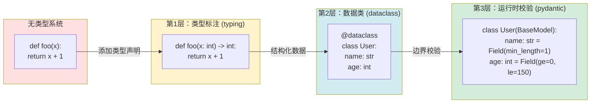
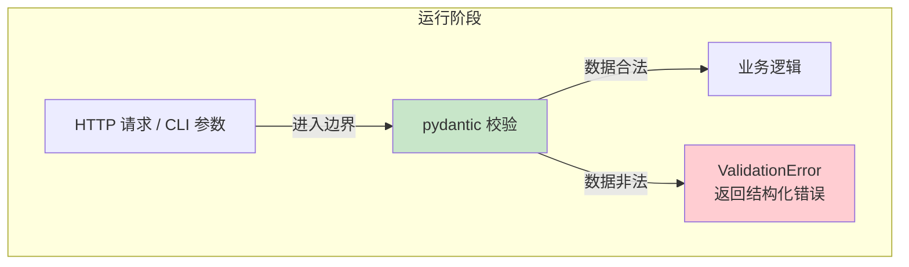
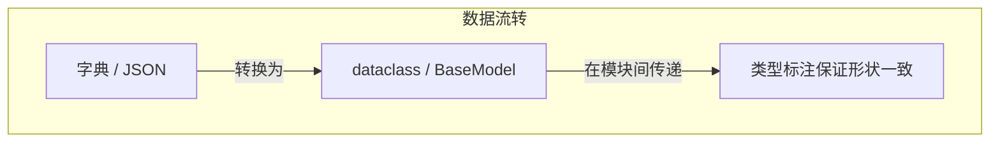

---
kernelspec:
  name: book-venv
  display_name: Python 3 (book)
---

# 类型系统与防御性编程

学完本节，你能回答：

- 为什么动态类型语言 Python 现在越来越强调类型标注？
- 类型标注、`dataclass`、`pydantic` 三者分别解决什么问题？它们之间是什么关系？
- 防御性编程的"防御"到底防什么？什么才算"尽早失败"？

> 如果把动态类型比作"口头约定"，类型标注就是"书面合同"——口头约定灵活但易生歧义，就像你在电话里和朋友说"帮我带个东西"，对方可能带回来一瓶水、一本书或一包纸巾；书面合同让双方在动手前就对齐了形状、尺寸与交付时间。口头约不需要签字，吵一架就散了；书面合同签了字，反悔之前得先看条款。

类型标注就像高铁站台的屏蔽门，你不必在列车进站时才靠肉眼判断它会不会撞到你，屏蔽门在乘客和轨道之间画了一条明确的线。没有屏蔽门的站台，偶尔有东西掉下去，大多数时候没事，但是这全靠乘客自觉和工作人员的责任心。Python 的灵活以"运行时才暴露形状错误"为代价——就像没有屏蔽门的地铁，站台看起来很敞亮，但每次列车进站你都忍不住退后半步。类型标注把这半步退让变成了安全距离。

## 为什么需要类型标注

许多 Python 开发者入行时听说的第一句话是"Python 是动态类型语言，可以不写类型"。这确实让 Python 写起来很快，变量想赋什么就赋什么，想在哪里写变量就在哪里写变量，函数想返回什么就返回什么，不像强类型语言一样，少一个符号，编译器就在耳边唠叨。

但这种"快"是有代价的。真正让人头疼的 bug 往往不在算法，而在**形状不匹配**：

- 某个函数预期收到 `list`，实际收到了 `None`
- 某个查询返回 `None`，你直接给它取下标
- 某个导出函数的参数既可以是 `dict` 也可以是对象，但调用方永远记不住
- 在字典里存了 `{"user_name": "张三"}`，取的时候写成 `["username"]`，拼写错了也不知道

这些 bug 的共同特征是：**它们不涉及复杂的逻辑，只涉及"东西长什么样"**。类型标注的价值就在于——把"这个东西长什么样"从**运行时才发现**提前到**编辑期就检查**。

确实，Python是动态类型的语言，灵活多变，但数据是有形状的，数字的加减法是数值的加减，字符串的加减是拼接，假如你确实知道你写的每一个变量是什么类型，我想你不会用错符号，可是不要指望人类这可怜的记忆力，还不如写在屏幕上吧——七秒记忆的碳基生命。类型系统不保证逻辑正确，但能把一大类"传错形状、用错空值、拼错字段"在提交前拦住。它是代码质量的第一道护栏。

## Python 类型系统的"三顶帽子"

在开始之前，先厘清一个常见困惑：**类型标注、`dataclass`、`pydantic` 三者不是选一个，而是递进关系**。

| 层级 | 工具 | 职责 | 检查时机 |
|------|------|------|----------|
| 第1层 | `typing` 类型标注 | 锁住"形状"——参数和返回值是什么类型 | 编辑期 |
| 第2层 | `@dataclass` | 固化"结构"——对象有哪些字段、什么类型、默认值是什么 | 创建对象时（类型不匹配在静态检查期暴露） |
| 第3层 | `pydantic.BaseModel` | 边界"校验"——值是否合法、长度是否超限、格式是否正确 | 对象创建时（运行时报 `ValidationError`） |

这三者之间的关系是：



层层递进，层层加固。接下来我们逐层拆解。

## 第1层：类型标注（`typing`）——锁住形状

类型标注是"给函数签名装护栏"。它不改变运行时行为，但让编辑器、`mypy` 等工具能够提前识别类型错误。

### 基础类型标注

**最小可用子集**，掌握这四个就够了：

1. **函数签名**：`def load(name: str, n: int) -> str:` 锁住输入与输出形状
2. **可选值**：`str | None`（Python 3.10+）或 `Optional[str]` 表示"可能为空"，逼迫调用方显式处理 `None` 分支
3. **泛型容器**：`list[dict[str, Any]]` 精确描述"列表里装的是字典，字典的值暂不约束"
4. **字面量约束**：`Literal["txt", "srt", "md"]` 让非法取值在检查期就不可表示

```{code-cell} python
from __future__ import annotations
from typing import Any, Literal, get_type_hints

# 1) 基础签名：锁住输入输出
def load(name: str, n: int) -> str:
    return f"{name}:{n}"

# 2) 可选值：str | None 逼迫调用方处理空值
def find_title(meta: dict[str, str]) -> str | None:
    return meta.get("title")

# 3) 泛型容器：列表里装字典
def summarize(rows: list[dict[str, Any]]) -> list[str]:
    return [str(r.get("text", "")) for r in rows]

# 4) 字面量约束：只允许三种取值
def export(text: str, fmt: Literal["txt", "srt", "md"] = "txt") -> str:
    return f"[{fmt}] {text}"

get_type_hints(load), get_type_hints(export)
```

### 进阶类型标注

当项目逐渐复杂，基础类型就不够用了。以下是常用的进阶类型工具：

**1. `Union` 与 `|`：一个值可能是多种类型**

Python 3.10+ 推荐使用 `|` 语法，更简洁直观：

```{code-cell} python
def parse(data: str | int) -> int:
    if isinstance(data, str):
        return int(data)
    return data

print("parse('42'):", parse("42"))
print("parse(100):", parse(100))
```

旧版 Python 则需要从 `typing` 导入 `Union`：

```{code-cell} python
from typing import Union

def parse_old(data: Union[str, int]) -> int:
    if isinstance(data, str):
        return int(data)
    return data

print("parse_old('42'):", parse_old("42"))
```

**2. `Optional`：明确表示"可能为 None"**

```{code-cell} python
from typing import Optional

def get_user_name(user_id: int) -> Optional[str]:
    if user_id == 1:
        return "张三"
    return None

print("get_user_name(1):", get_user_name(1))
print("get_user_name(2):", get_user_name(2))
```

**3. `TypedDict`：给字典定义形状**

`TypedDict` 让字典也有了"固定的字段和类型"，适合处理 JSON 数据或数据库行记录：

```{code-cell} python
from typing import TypedDict

class UserDict(TypedDict):
    id: int
    name: str
    email: str | None

# 类型检查器会检查字段名和类型
user: UserDict = {"id": 1, "name": "张三", "email": None}

# 以下代码在 mypy 检查时会报错（id 应为 int），但运行时不会报错
user_wrong: UserDict = {"id": "1", "name": "张三"}

user, user_wrong
```

`TypedDict` 与 `dataclass` 的区别在于：`TypedDict` 是"字典的形状描述"，不创建类实例，适合与 JSON/API 交互；`dataclass` 是真正的类，适合业务逻辑内部使用。

**4. `Protocol`：定义"鸭子类型"的接口**

`Protocol` 描述一个类"应该有哪些方法"，而不要求它继承某个基类：

```{code-cell} python
from typing import Protocol

class HasName(Protocol):
    name: str

def greet(obj: HasName) -> str:
    return f"Hello, {obj.name}"

# 任何有 name 属性的对象都可以传入
class Person:
    name = "张三"

class Dog:
    name = "旺财"

print(greet(Person()))
print(greet(Dog()))
```

**5. `TypeVar`：泛型，让函数可接受多种类型但保持关系**

```{code-cell} python
from typing import TypeVar

T = TypeVar('T')

def first(items: list[T]) -> T:
    return items[0]

nums: list[int] = [1, 2, 3]
strings: list[str] = ["a", "b"]

print("first(nums):", first(nums))
print("first(strings):", first(strings))
```

**6. `Final`：常量，禁止重新赋值**

```{code-cell} python
from typing import Final

MAX_RETRY: Final[int] = 3
print("MAX_RETRY:", MAX_RETRY)
# mypy 会报错：不能给 Final 变量重新赋值
MAX_RETRY = 5
```

## 第2层：`@dataclass`——固化数据结构

当数据从"随意字典"升级为"固定结构"时，`dataclass` 是最轻量的形状固化工具。

### 为什么需要 dataclass

在没有 `dataclass` 的时代，我们用字典传递结构化数据：

```{code-cell} python
# 旧方式：字典 + 约定
user = {"name": "张三", "age": 25}
user["namme"] = "李四"  # 拼写错误，运行时才发现
print("被污染的字典:", user)
```

这种方式的根本问题在于：**字段名和类型全靠"约定"，拼写错了没人告诉你**。谁也不会主动说"我是不是写错了"。

`dataclass` 的改进在于，把"有哪些字段、字段是什么类型、默认值是什么"从隐式约定变为显式定义：

```{code-cell} python
from dataclasses import dataclass, field, asdict, astuple
from typing import Literal

@dataclass
class Task:
    id: str
    filename: str
    status: Literal["pending", "running", "done", "failed"] = "pending"
    segments: list[str] = field(default_factory=list)

# 正常创建：形状清晰，默认值生效
t1 = Task(id="t-001", filename="report.txt")
print("t1:", t1)
print("asdict:", asdict(t1))
print("astuple:", astuple(t1))
```

```{code-cell} python
# 追加片段：default_factory 保证每个实例独立列表
t1.segments.append("hello")
t2 = Task(id="t-002", filename="notes.txt")
print("t1 segments:", t1.segments)
print("t2 segments:", t2.segments)
```

当字段名写错时，`dataclass` 会在创建对象时抛出 `TypeError`，立即暴露问题：

```{code-cell} python
# 非法字段：创建时即抛 TypeError，提早暴露拼写错误
try:
    Task(id="t-003", filename="a.txt", unknown_field="oops")
except TypeError as e:
    print("捕获到拼写错误:", e)
```

### dataclass 的高级用法

**1. `field()` 的完整参数**

`field()` 提供了精细控制每个字段行为的能力：

| 参数 | 作用 |
|------|------|
| `default` | 默认值（不可变类型用这个） |
| `default_factory` | 默认值工厂（可变类型用这个，如 `list`、`dict`） |
| `repr` | 是否包含在 `__repr__` 中 |
| `compare` | 是否参与比较运算 |
| `hash` | 是否参与哈希计算 |
| `metadata` | 附加元数据（如字段描述） |

```{code-cell} python
from dataclasses import dataclass, field

@dataclass
class Product:
    name: str
    price: float = field(default=0.0, compare=True)
    tags: list[str] = field(default_factory=list, repr=False)  # repr 中不显示
    internal_id: int = field(init=False, default=0)  # init=False 表示不通过 __init__ 传入
    description: str = field(default="", metadata={"max_length": 200})

p = Product(name="笔记本", price=99.9)
p.tags.append("电子产品")
print("Product:", p)
print("internal_id:", p.internal_id)
```

**2. `frozen=True`：不可变对象**

```{code-cell} python
from dataclasses import dataclass

@dataclass(frozen=True)
class ImmutablePoint:
    x: int
    y: int

p = ImmutablePoint(1, 2)
print("Point:", p)
# p.x = 3  # ❌ 取消注释会报错：无法修改 frozen 实例
```

适合用作字典的 key，或确保对象创建后不被意外修改。

**3. `order=True`：自动支持比较运算**

```{code-cell} python
from dataclasses import dataclass

@dataclass(order=True)
class Score:
    value: int

s1 = Score(80)
s2 = Score(90)
print("s1 < s2:", s1 < s2)
```

**4. `__post_init__`：初始化后的处理钩子**

```{code-cell} python
from dataclasses import dataclass, field

@dataclass
class Person:
    first_name: str
    last_name: str
    full_name: str = field(init=False)

    def __post_init__(self):
        self.full_name = f"{self.first_name} {self.last_name}"

p = Person("张", "三")
print("full_name:", p.full_name)
```

**5. 与 `__slots__` 配合节省内存**

```{code-cell} python
from dataclasses import dataclass

@dataclass(slots=True)  # Python 3.10+
class EfficientTask:
    id: str
    name: str

t = EfficientTask(id="001", name="任务")
print("EfficientTask:", t)
```

> **工程启示**：字典适合临时拼接，`dataclass` 适合在模块边界与存储层之间传递的结构化数据。它让"有哪些字段、字段是什么类型、默认值是什么"从隐式约定变为显式定义。

## 第3层：`pydantic.BaseModel`——边界运行时校验

`dataclass` 固化了形状，但默认不做运行时值校验。例如，你可以创建一个 `age: int` 字段并赋值为 `-5`，它在技术上"合法"，但在业务上"不合理"。

`pydantic.BaseModel` 在此之上补上了**边界运行时校验**：

```{code-cell} python
from pydantic import BaseModel, Field, ValidationError
from typing import Literal

class CreateTaskIn(BaseModel):
    filename: str = Field(min_length=1, max_length=128, description="文件名不能为空且不超过128字符")
    fmt: Literal["txt", "srt", "md"] = "txt"
    priority: int = Field(default=1, ge=1, le=5, description="优先级1-5")

# 合法输入：直接通过
ok = CreateTaskIn(filename="report.txt", fmt="md", priority=3)
print("ok:", ok.model_dump())
```

```{code-cell} python
# 空字符串：被 min_length 拦截
try:
    CreateTaskIn(filename="", fmt="txt")
except ValidationError as e:
    errors = e.errors()
    print("空文件名错误:", errors[0]["loc"], errors[0]["type"])
```

```{code-cell} python
# 越界：priority 超出 [1,5] 被拦截
try:
    CreateTaskIn(filename="a.txt", priority=10)
except ValidationError as e:
    errors = e.errors()
    print("范围错误:", errors[0]["loc"], errors[0]["type"])
```

### Field 的常用校验参数

| 参数 | 用途 | 示例 |
|------|------|------|
| `min_length` / `max_length` | 字符串/列表长度 | `min_length=1, max_length=100` |
| `ge` / `le` | 数值范围（>= / <=） | `ge=0, le=150` |
| `gt` / `lt` | 数值范围（> / <） | `gt=0, lt=100` |
| `pattern` | 正则匹配（字符串） | `pattern=r"^[A-Z].*$"` |
| `multiple_of` | 数值倍数 | `multiple_of=0.5` |
| `max_items` / `min_items` | 列表元素数量 | `min_items=1` |
| `description` | 字段描述（用于 API 文档） | `description="用户名"` |

```{code-cell} python
from pydantic import BaseModel, Field

class UserCreate(BaseModel):
    username: str = Field(min_length=3, max_length=20, pattern=r"^[a-zA-Z0-9_]+$")
    age: int = Field(ge=0, le=150)
    score: float = Field(ge=0.0, le=100.0, multiple_of=0.5)
    tags: list[str] = Field(default_factory=list, max_length=10)

# 合法输入
u = UserCreate(username="zhangsan", age=25, score=95.5, tags=["admin"])
print("合法用户:", u.model_dump())
```

```{code-cell} python
# 非法输入：正则不匹配
try:
    UserCreate(username="张三", age=25)  # 中文不符合正则
except ValidationError as e:
    print("用户名格式错误:", e.errors()[0]["type"])
```

### 嵌套模型与复杂结构

```{code-cell} python
from pydantic import BaseModel

class Address(BaseModel):
    city: str
    district: str

class UserProfile(BaseModel):
    name: str
    address: Address
    contact: list[dict[str, str]]  # 复杂嵌套

data = {
    "name": "张三",
    "address": {"city": "北京", "district": "海淀"},
    "contact": [{"phone": "13800000000"}]
}
profile = UserProfile(**data)
print("嵌套模型解析成功:")
print("  姓名:", profile.name)
print("  城市:", profile.address.city)
print("  联系人:", profile.contact)
```

### 自定义校验器

当内置校验不够用时，可以用 `@field_validator` 或 `@model_validator`：

```{code-cell} python
from pydantic import BaseModel, Field, field_validator, model_validator

class Order(BaseModel):
    product: str
    quantity: int
    unit_price: float
    total: float | None = None

    # 单字段校验
    @field_validator("quantity")
    @classmethod
    def quantity_positive(cls, v: int) -> int:
        if v <= 0:
            raise ValueError("数量必须大于0")
        return v

    # 跨字段校验（模型级）
    @model_validator(mode="after")
    def calculate_total(self) -> "Order":
        if self.total is None:
            self.total = self.quantity * self.unit_price
        return self

order = Order(product="笔记本", quantity=3, unit_price=99.9)
print("自定义校验结果:")
print("  数量:", order.quantity)
print("  总价:", order.total)
```

```{code-cell} python
# 非法数量
try:
    Order(product="笔记本", quantity=-1, unit_price=99.9)
except ValidationError as e:
    print("数量校验失败:", e.errors()[0]["type"])
```

### 从字典/JSON 解析

```{code-cell} python
from pydantic import BaseModel, Field

class CreateTaskIn(BaseModel):
    filename: str = Field(min_length=1)
    priority: int = Field(default=1, ge=1, le=5)

# 从字典解析
raw_data = {"filename": "test.txt", "priority": 2}
task = CreateTaskIn.model_validate(raw_data)
print("从字典解析:", task.model_dump())

# 从 JSON 解析
json_str = '{"filename": "test.txt", "priority": 2}'
task = CreateTaskIn.model_validate_json(json_str)
print("从JSON解析:", task.model_dump())

# 序列化输出
print("序列化为字典:", task.model_dump())
print("序列化为JSON:", task.model_dump_json())
```

### 配置项：`ConfigDict`

```{code-cell} python
from pydantic import BaseModel, ConfigDict

class User(BaseModel):
    model_config = ConfigDict(
        extra="forbid",          # 禁止额外字段
        str_strip_whitespace=True,  # 自动去除首尾空格
    )
    name: str
    age: int

# 合法输入
u = User(name=" 张三 ", age=25)
print("配置生效（空格被去除）:", u.model_dump())
```

```{code-cell} python
# 传入额外字段会报错
try:
    User(name="张三", age=25, extra_field="oops")
except ValidationError as e:
    print("额外字段被拒绝:", e.errors()[0]["type"])
```

| 配置 | 作用 | 常用值 |
|------|------|--------|
| `extra` | 控制额外字段行为 | `"forbid"`（拒绝）、`"ignore"`（忽略）、`"allow"`（允许） |
| `str_strip_whitespace` | 字符串自动去首尾空格 | `True` |
| `str_to_lower` / `str_to_upper` | 字符串自动转换大小写 | `True` |
| `validate_default` | 是否校验默认值 | `True` |
| `frozen` | 模型是否可变 | `True` |

> **工程启示**：`pydantic` 把防御性编程的"校验逻辑"从业务代码中抽离出来，放在数据边界处统一处理。非法数据在入口处被拦截，深层代码只需要处理"合法数据"。这是"Fail Fast"原则的落地。

简单来说，typing、dataclass、pydantic代表了 Python 在类型系统这条路上的几个关键节点：typing 为语言带来了类型声明的语法规范，dataclass 让用类型定义数据结构更简单，而 Pydantic 则将这种类型信息从"仅用于提示"的范畴，扩展到了"能用于运行时数据校验和序列化"这个极具实用价值的领域，从而迎来了真正的广泛采用。

## 类型系统的协作关系






三者各司其职，构成完整链路：

| 场景 | 工具 | 检查内容 |
|------|------|----------|
| 写代码时 | 类型标注 + 编辑器 | 参数类型、返回值类型、空值处理 |
| 提交前 | `mypy` + `ruff` | 类型不一致、未使用的变量、风格问题 |
| 运行时（边界） | `pydantic` | 值是否合法、长度是否超限、格式是否正确 |
| 运行时（内部） | `dataclass` | 数据结构是否完整、字段是否缺失 |