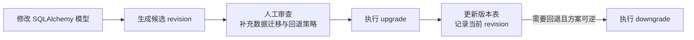

---
kernelspec:
  name: book-venv
  display_name: Python 3 (book)
---

# 数据库迁移

学完本节，你能回答：

- 为什么直接登录每个环境手工改表，会让数据库状态不可追踪？
- Alembic 的 revision、`upgrade()`、`downgrade()` 与版本表分别承担什么职责？
- 为什么自动生成迁移后仍必须人工审查，并为不可逆变更准备恢复方案？

> 营业中的医院不能因为要增加一个诊室，就推倒整栋楼重新盖。施工队需要知道当前建筑版本、这次改哪面墙、病人从哪里绕行，以及出现问题时如何恢复服务。数据库迁移也是“带着历史数据施工”：目标不只是得到一张新表，而是让开发、测试和生产从各自当前版本安全走到同一个目标版本。

代码修改会随 Git 提交进入各环境，表结构却不会因为模型类改了就自动同步。如果团队靠群消息通知“记得加一列”，每个数据库就可能停在不同状态，而应用代码又默认它们完全一致。

## 手工改表能完成：缺了什么

**1. 当前版本无法被可靠回答**

开发库已经有 `enrolled_at`，测试库没有，生产库可能只有索引没有列。故障发生时，团队只能逐库猜测。

```text
OperationalError: no such column: enrolled_at
```

**2. 变更顺序无法重放**

先加可空列、回填历史数据、再改成非空，和直接增加非空列不是同一件事。只有最终建表 SQL，没有中间步骤，新环境便无法复现安全路径。

**3. 回退不等于把代码切回去**

旧版应用可能不认识新列，新版迁移又可能删除或重写数据。代码回滚与数据库回退是两条相关但不同的链路，必须分别设计。

这些问题的系统性根因是：**表结构变化没有作为代码资产进入版本链，环境之间缺少可计算的升级路径**。

### 从临时 SQL 到版本化变更

上述问题——状态不明、步骤不可重放、恢复无路径——可以用同一个机制收敛：**每次结构变化都生成带前后依赖的 revision，审查后由工具按版本链执行**。

## 迁移链路：生成、审查、执行、记录



这张图刻意把“人工审查”放在自动生成与执行之间。Alembic 的 autogenerate 是候选脚本生成器，不是数据库变更的自动驾驶：重命名可能被识别成“删旧列、加新列”，数据搬迁、复杂约束和某些类型变化也需要人工补充。

## 对照示例：给 `students` 加列并建索引

沿用 5.1 / 5.2 的学生管理例子，假设已有：

```sql
CREATE TABLE students (
    id TEXT PRIMARY KEY,
    name TEXT NOT NULL,
    created_at TEXT NOT NULL DEFAULT (datetime('now'))
);
```

新需求来了：需要记录入学时间 `enrolled_at`，并且按入学时间筛选会变多，需要一个索引。与其让每个人手动 `ALTER TABLE`，我们把这次变更写成一次迁移：加一列 `enrolled_at`，再建一个索引 `idx_students_enrolled_at`。回滚时则反向操作——删索引、删列。

这就是迁移的日常形态：一个小步、一个提交、可进可退。

## 可运行示例：`ALTER TABLE ADD COLUMN` 不丢数据

`SQLite` 的 `ADD COLUMN` 不会删除已有行。对本例这种不带复杂约束的新列，历史行读取该列时会得到声明的 `DEFAULT`；这不代表所有 `ALTER TABLE` 都同样轻量，新增 `NOT NULL`、`CHECK`、外键或删除列都有额外限制。下面用标准库 `sqlite3` 验证本次变更：

```{code-cell} ipython3
import sqlite3

conn = sqlite3.connect(":memory:")
conn.row_factory = sqlite3.Row
conn.executescript("""
CREATE TABLE students (
    id TEXT PRIMARY KEY,
    name TEXT NOT NULL,
    created_at TEXT NOT NULL DEFAULT (datetime('now'))
);
INSERT INTO students (id, name) VALUES ('s1', 'Alice');
INSERT INTO students (id, name) VALUES ('s2', 'Bob');
""")
conn.commit()

# 迁移前：已有数据
rows_before = conn.execute("SELECT id, name FROM students ORDER BY id").fetchall()
print("before:", [(r["id"], r["name"]) for r in rows_before])
assert len(rows_before) == 2

# 加列：新增 enrolled_at，不影响已有行
conn.execute("ALTER TABLE students ADD COLUMN enrolled_at TEXT DEFAULT '2026-01-01'")
conn.commit()

cols = [r[1] for r in conn.execute("PRAGMA table_info(students)").fetchall()]
print("columns:", cols)
assert "enrolled_at" in cols

# 老数据仍在，新列有默认值
rows_after = conn.execute("SELECT id, name, enrolled_at FROM students ORDER BY id").fetchall()
print("after:", [(r["id"], r["name"], r["enrolled_at"]) for r in rows_after])
assert rows_after[0]["enrolled_at"] == "2026-01-01"

# 新写入的行可以指定 enrolled_at
conn.execute("INSERT INTO students (id, name, enrolled_at) VALUES (?, ?, ?)", ("s3", "Carol", "2026-03-15"))
conn.commit()

# 为新列建索引，加速按入学时间查询
conn.execute("CREATE INDEX idx_students_enrolled_at ON students(enrolled_at)")
conn.commit()
idx = conn.execute("SELECT name FROM sqlite_master WHERE type='index' AND name='idx_students_enrolled_at'").fetchone()
print("index exists:", idx is not None)
assert idx is not None

# 验证：按索引列查询正常
hit = conn.execute("SELECT id FROM students WHERE enrolled_at = ?", ("2026-03-15",)).fetchone()
print("query by enrolled_at:", hit["id"])
assert hit["id"] == "s3"

conn.close()
print("校验通过：加列不丢数据，索引可用")
# 预期输出:
# before: [('s1', 'Alice'), ('s2', 'Bob')]
# columns: ['id', 'name', 'created_at', 'enrolled_at']
# after: [('s1', 'Alice', '2026-01-01'), ('s2', 'Bob', '2026-01-01')]
# index exists: True
# query by enrolled_at: s3
# 校验通过：加列不丢数据，索引可用
```

本例证明的是一条具体迁移路径：增加带常量默认值的列后，旧行仍可读取，新索引也能创建。它不能推出“所有加列都安全”，更不能替代生产迁移前的备份、容量评估和回滚演练。

## 真实 Alembic 长什么样（仅示意，不执行）

本书可运行示例只用 `sqlite3`，不依赖 Alembic；真实项目中的文件与命令形状如下，供对照：

```bash
# 初始化（生成 alembic.ini 与 alembic/ 目录）
alembic init alembic

# 生成候选迁移脚本（对比 metadata 与数据库差异，生成后必须审查）
alembic revision --autogenerate -m "add enrolled_at to students"

# 升级到最新 / 回退一版 / 查看当前版本
alembic upgrade head
alembic downgrade -1
alembic current
```

`alembic.ini` 指向数据库连接，`alembic/env.py` 关联 `SQLAlchemy` 的 `Base.metadata`：

```python
# alembic.ini（节选，仅示意）
# [alembic]
# script_location = alembic
# sqlalchemy.url = sqlite:///students.db
```

每个 revision 通常对应一个 Python 脚本：`upgrade()` 描述如何到达新版本，`downgrade()` 描述如何回到上一版本。两者应尽量成对设计，但删除列、数据格式转换等操作可能天然丢失信息，此时 downgrade 只能恢复结构，不能凭空恢复已经删除的数据。

```python
# alembic/versions/20260315_add_enrolled_at.py（仅示意，不在本书环境执行）
# revision = "20260315_a1b2c3"
# down_revision = "20260301_prev"
#
# from alembic import op
# import sqlalchemy as sa
#
# def upgrade():
#     op.add_column("students", sa.Column("enrolled_at", sa.Text(), nullable=True))
#     op.create_index("idx_students_enrolled_at", "students", ["enrolled_at"])
#
# def downgrade():
#     op.drop_index("idx_students_enrolled_at", table_name="students")
#     op.drop_column("students", "enrolled_at")
```

> **与 `m2t/store.py` 的关系**：`TaskStore` 用 `CREATE TABLE IF NOT EXISTS` 适合教学起步；当 `tasks` 或 `students` 需要新增列或加索引时，生产中应新增一次 Alembic 迁移，而不是直接改 `SCHEMA` 字符串后“删库重建”。

> **选型中立性**：迁移思想不限于 Alembic（`Django migrations` / `yoyo-migrations` 等亦同），核心都是“版本化、可重放、可回滚”；Alembic 因与 `SQLAlchemy` 协同最紧密而作为本书示例。

回到医院改造的比喻：revision 是施工单，`upgrade()` 是施工步骤，版本表是楼层入口处的当前状态牌，`downgrade()` 则是预先设计的恢复路径。真正可靠的迁移不是“命令执行成功”，而是每个环境都能说明自己在哪里、下一步去哪，以及数据发生不可逆变化时从哪里恢复。
