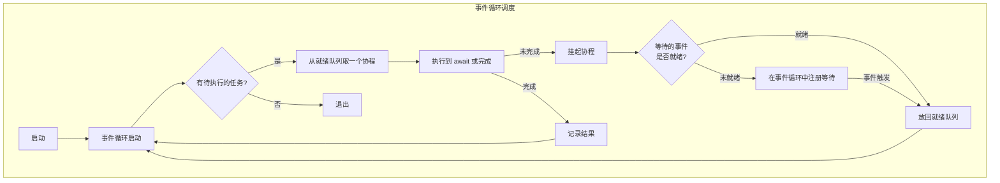
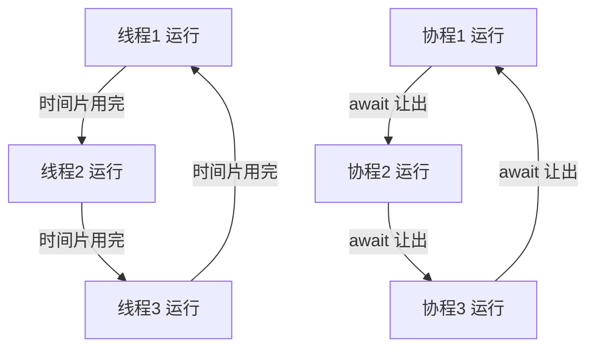

---
kernelspec:
  name: book-venv
  display_name: Python 3 (book)
---

# 6.3 异步编程核心

学完本节，你能回答：

- 事件循环是什么？它如何驱动协程的执行？
- `async`/`await` 的实质是什么？协程和普通函数的区别在哪里？
- Task 和 Future 分别承担什么角色？它们之间的关系是什么？
- asyncio 的协作式调度是如何工作的？它和抢占式调度的根本差异在哪里？

> 多线程与协程的核心差异，在于切换决策权的归属。

上一节的实测中，多线程让 10 个 I/O 任务从 1.0 秒优化到了 0.1 秒。但线程不是没有成本的。从实现层面看，线程切换涉及寄存器保存、栈切换、内核态与用户态的上下文转换，是微秒级的操作；协程切换仅需在用户空间传递一个 Python 对象，开销是纳秒级。这个数量级的差异，在 I/O 密集型的高并发场景中决定了吞吐量的上限，当并发规模从数百升至数万时，线程的调度成本和内存占用（每线程约 8 MB）会迅速成为瓶颈，而协程的轻量化机制让大规模并发成为可能。

`asyncio` 提供了一种不同的路径：**单线程、协作式调度、极低开销**。它不依赖操作系统线程，而是用一个用户态的事件循环来管理所有并发任务。

## 实验

先用计时器感受 asyncio 的核心机制。

```{code-cell} python
import asyncio
import time

async def task(name: str, delay: float) -> str:
    print(f"{name} 开始")
    await asyncio.sleep(delay)
    print(f"{name} 结束")
    return f"{name} 完成"

async def main():
    t0 = time.perf_counter()
    results = await asyncio.gather(
        task("A", 0.3),
        task("B", 0.1),
        task("C", 0.2),
    )
    print(f"总耗时: {time.perf_counter() - t0:.3f}s")
    print(results)

await main()
```

输出中三个任务按各自的 sleep 时长依次结束，但总耗时约等于最长的那一个（0.3 秒），而非三者之和。这个“重叠等待”的效果与多线程类似，但实现方式完全不同：没有创建任何操作系统线程，所有任务运行在同一个线程中，通过事件循环调度。

## 事件循环：心脏与调度器

事件循环是 asyncio 的核心。它的工作方式可以概括为一个无限循环：

```
while True:
    就绪任务 = 从就绪队列取下一个任务
    执行该任务直到它 await
    如果任务未完成，放回就绪队列
    检查是否有已完成的 Future
```



核心要点：

- 事件循环运行在**单线程**中，所有协程共享同一个线程
- 协程通过 `await` **主动让出**控制权，而不是被操作系统强制切换
- 调度是**协作式**的，协程自己决定什么时候暂停

这个模型的关键优势在于：**没有操作系统参与调度，切换开销极小**。劣势同样直接：如果某个协程不主动让出（比如执行了阻塞 I/O 或死循环），整个事件循环都会被卡住。

## async/await：协作式调度的语法基础

`async def` 定义的函数返回一个**协程对象**，而不是普通值。这个对象不会在调用时执行，需要被事件循环驱动才能运行。

```{code-cell} python
async def fetch_data() -> str:
    return "data"

# 调用 async 函数返回协程对象，不会立即执行
coro = fetch_data()
print(type(coro))
print(coro)  # 协程对象本身，还没有执行

# 需要用 await 或 asyncio.run() 来驱动
```

`await` 是协程主动让出控制权的语法标记。当一个协程执行到 `await` 时，它暂停当前协程，将控制权交还给事件循环，让事件循环去执行其他就绪的协程。被 `await` 的对象（称为 Awaitable）通常是：

- 另一个协程
- 一个 Task
- 一个 Future
- 一个实现了 `__await__` 方法的对象

```python
# await 的实质
await some_coroutine()
# 等价于：
# 1. 当前协程暂停
# 2. 将 some_coroutine 提交给事件循环
# 3. 事件循环调度执行 some_coroutine
# 4. 当 some_coroutine 完成时，恢复当前协程
```

## 从“调度什么”到 Task

事件循环的核心功能是“调度”。但调度的是什么？不是协程对象本身，协程对象只是一个可暂停的函数，它还没有被“提交”到事件循环中。事件循环调度的是一个更具体的概念：**Task**。

**Task** 是将协程包装后提交给事件循环的调度单元。它负责管理协程的执行状态，跟踪它是否完成、结果是什么、发生异常时如何传递。

```{code-cell} python
async def slow_operation():
    await asyncio.sleep(1)
    return "计算结果"

# 普通调用不会执行协程，它只返回一个协程对象
coro = slow_operation()

# 把协程包装成 Task，提交给事件循环调度
task = asyncio.create_task(slow_operation())
```

如果把协程比作一份“待办事项清单”，Task 就是贴在清单上的“追踪标签”，它记录了这份清单被谁领取了、做完了没有、结果在哪里。

## 从“结果”到 Future

协程与协程之间需要传递结果。协程 A 等待协程 B 完成后获取 B 的返回值，这个返回值在 B 完成之前，是一个“尚未存在的占位符”。**Future** 就是这个占位符。

Future 是一个“承诺将来会有结果”的容器。它不关心结果如何产生，只负责在结果就绪时通知等待者。

```{code-cell} python
import asyncio

async def demo_future():
    loop = asyncio.get_running_loop()
    # 创建一个 Future，一个空的结果容器
    future = loop.create_future()
    
    # 1 秒后往容器里放入结果
    loop.call_later(1, future.set_result, "数据已就绪")
    
    # 等待容器被填满
    result = await future
    print(result)
```


## Task 与 Future 的关系

Task 是 Future 的子类。这意味着 Task 本身也是一个“结果容器”：

- **Task** = 协程的包装器 + 结果容器
- 当 Task 所包装的协程执行完毕，Task 的“结果容器”就被自动填满了

换句话说：你不需要手动往 Task 里放结果，协程的返回值会自动成为 Task 的结果。而 Future 的结果需要由外部（回调、调用者）手动设置。

```python
# Task 是 Future 的子类，所以 Task 可以当 Future 用
task = asyncio.create_task(slow_operation())
# 当 slow_operation 完成时，task 的结果就是 "计算结果"
result = await task  # 等待 Task 完成，获取结果
```

在实际开发中，99% 的场景你只需要关心 Task，它既是“调度单元”又是“结果容器”，你用它提交协程、等待完成、获取结果。Future 通常出现在 asyncio 的底层实现中，或用于将回调风格的 API 封装成可等待的协程。

**对比总结**：

| | Future | Task |
|---|---|---|
| 本质 | 结果容器 | 协程 + 结果容器 |
| 谁产生结果 | 外部（回调、调用者） | 协程执行完毕 |
| 是否可执行 | 否（仅占位） | 是（包装了协程） |
| 何时创建 | 需要占位符时 | 需要并发执行协程时 |
| 常见场景 | 封装回调 API、底层实现 | 业务代码并发执行 |

工程启示：日常开发中，你直接打交道的是 Task（`asyncio.create_task()`），Future 通常出现在 asyncio 的底层实现中，或者用于将回调风格的 API 封装成可等待的协程。

## 调度示例

下面的示例展示了事件循环的调度顺序，帮助学生直观理解“协作式”的含义。

```{code-cell} python
import asyncio

async def task_a():
    print("A: 开始")
    await asyncio.sleep(0.1)
    print("A: 第一次让出后恢复")
    await asyncio.sleep(0.1)
    print("A: 第二次让出后恢复")
    return "A完成"

async def task_b():
    print("B: 开始")
    await asyncio.sleep(0.05)
    print("B: 让出后恢复")
    return "B完成"

async def main():
    # 并发执行，观察交错输出
    results = await asyncio.gather(task_a(), task_b())
    print(results)

await main()
```

观测要点：输出中 A 和 B 交错打印，说明事件循环在二者之间切换。每个协程在 `await` 处主动让出，事件循环据此切换到另一个就绪的协程。没有协程会被强制中断，每个协程只在它主动 `await` 时才会被切换。

## 线程与协程的调度对比



| 维度 | 线程（抢占式） | 协程（协作式） |
|---|---|---|
| 切换时机 | 由操作系统决定 | 由协程的 `await` 决定 |
| 切换开销 | 微秒级（保存寄存器、栈） | 纳秒级（传递 Python 对象） |
| 并发上限 | 数百到数千 | 数万到数十万 |
| 竞争风险 | 数据竞争（需加锁） | 无数据竞争（单线程） |
| 阻塞代价 | 阻塞线程，其他线程继续 | 阻塞协程，整个事件循环卡死 |

## 本节小结

asyncio 的协作式并发模型与多线程有着本质的区别。事件循环是调度的核心，它在单线程中驱动所有协程的运行；`async`/`await` 提供了协作式调度的语法基础，让协程可以在等待 I/O 时主动让出控制权；Task 是协程的调度单元，Future 是结果的占位容器，它们共同构成了 asyncio 的并发执行框架。

协程的协作式调度带来了极低的切换开销和极高的并发上限，代价是要求所有协程都能“讲礼貌”，及时 `await`、避免阻塞调用。一旦某个协程不遵守约定，整个事件循环都会被影响。这个约束在带来性能优势的同时，也引入了新的陷阱。下一节我们会看到，在 FastAPI 中，一个看似无害的同步调用是如何把整个异步服务拖垮的。