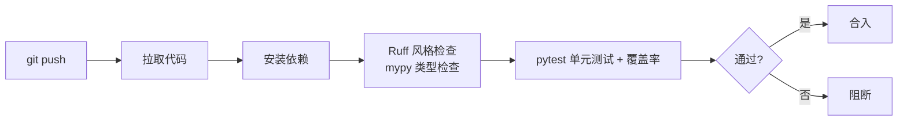

---
kernelspec:
  name: book-venv
  display_name: Python 3 (book)
---

# 测试、覆盖率与 CI

学完本节，你能回答：

- 为什么"本地能跑"不等于"上线能跑"？手动测试的局限在哪里？
- 单元测试、集成测试、端到端测试分别解决什么问题？它们的比例应该是多少？
- `pytest` 的核心能力是什么？`fixture`、`parametrize`、`mock` 分别在什么场景下使用？
- 覆盖率 100% 等于代码没问题吗？覆盖率的目标应该是多少？
- CI/CD 如何把类型检查、风格检查、测试串成一条自动化流水线？

> 如果把类型检查比作"审图纸"，静态检查比作"巡检工地"，那测试就是"竣工验收"——图纸画得再规范、工地再整洁，楼盖好了得有人进去住一住、压一压，才知道承重墙到底顶不顶用。没有测试的代码就像没验收的大楼：开发商说"按图纸施工的"，但你敢搬进去住吗？

> **测试就像飞机的"黑匣子"** ——不是为了证明飞机会不会掉下来，而是为了在它掉下来的时候，你知道是哪里出了问题。没有测试的代码，每次上线都像第一次试飞；有测试的代码，改完一行就能知道有没有把翅膀拆了。

前两节我们让代码"形状对"、"写得规范"，这一节我们验证它"跑得对"。三者合起来，才是"可审查"的完整基线。

## 为什么需要自动化测试

### 一个真实的故事

你接手了一个项目，里面有一个函数：

```python
def calculate_discount(price: float, user_type: str) -> float:
    if user_type == "vip":
        return price * 0.8
    elif user_type == "member":
        return price * 0.9
    else:
        return price
```

看起来很简单。产品经理说："加一个'年度会员'类型，打 85 折。"你改了代码：

```python
def calculate_discount(price: float, user_type: str) -> float:
    if user_type == "vip":
        return price * 0.8
    elif user_type == "member":
        return price * 0.9
    elif user_type == "annual":   # 新增
        return price * 0.85
    else:
        return price
```

上线后发现：**所有会员都变成原价了**。原因是调用方传的是 `"MEMBER"`（大写），但代码里比较的是 `"member"`（小写）。你改了一行，炸了 1000 个会员的折扣。

这个 bug 的本质是：**你只测试了"新功能是否工作"，没测试"旧功能是否被破坏"**。手动测试只会关注"我改了什么"，而自动化测试会告诉你"你改的东西有没有影响其他东西"。

### 测试的价值

测试的价值不是"找 bug"，而是：

1. **给重构铺路**：有测试兜底，你才敢放心改代码。没有测试的代码，每次修改都像走钢丝。
2. **可执行的文档**：测试代码写清楚了"这个函数在各种输入下应该输出什么"，比文档更精确、更权威。
3. **回归保护**：改了一行代码，跑一遍测试就知道有没有破坏已有功能——这是手动测试做不到的。

## 测试金字塔：单元测试、集成测试、端到端测试

测试不是"越多越好"，而是"不同层次做不同的事"。测试金字塔给出了三类测试的推荐比例：

```
    /____E2E____\      少数、慢、覆盖链路（如 FastAPI /upload -> 导出）
   /_Integration_\     适量、较慢、覆盖协作（如 store + export 组合）
  /______Unit_____\    大量、快、覆盖纯函数（如 export、normalize_result）
```

### 单元测试（Unit Test）

- **测试什么**：单个函数、单个类的方法，隔离所有外部依赖
- **特点**：快（毫秒级）、稳定、数量最多
- **占比建议**：约 70%
- **示例**：`test_calculate_discount()` 覆盖 VIP、会员、普通用户、边界值

```python
def test_calculate_discount_vip():
    assert calculate_discount(100.0, "vip") == 80.0

def test_calculate_discount_member():
    assert calculate_discount(100.0, "member") == 90.0

def test_calculate_discount_normal():
    assert calculate_discount(100.0, "normal") == 100.0
```

### 集成测试（Integration Test）

- **测试什么**：多个模块之间的协作——函数调用数据库、调用外部 API、读写文件
- **特点**：慢（秒级）、可能因环境变化而失败、数量适中
- **占比建议**：约 20%
- **示例**：`test_save_order_to_database()` 验证订单保存后能从数据库正确读取

```python
def test_save_order_to_database(db_connection):
    order = Order(id=1, total=100.0)
    save_order(db_connection, order)
    loaded = load_order(db_connection, 1)
    assert loaded.total == 100.0
```

### 端到端测试（End-to-End Test）

- **测试什么**：完整的用户场景——从 HTTP 请求到数据库到响应，一气呵成
- **特点**：最慢（分钟级）、最脆弱、数量最少
- **占比建议**：约 10%
- **示例**：`test_full_checkout_flow()` 模拟用户登录、选商品、下单、支付、查订单

```python
def test_full_checkout_flow(client):
    # 模拟用户完整购物流程
    client.login("test_user")
    client.add_to_cart("product_123")
    client.checkout()
    order = client.get_last_order()
    assert order.status == "paid"
```

### 测试金字塔的核心原则

- **下层测试跑得快**，所以多写。每次提交跑 1000 个单元测试只要 10 秒，你愿意跑。
- **上层测试跑得慢**，所以少写。每次提交跑 10 个端到端测试要 5 分钟，你会想跳过。
- **下层测试定位精确**：单元测试失败了，你知道是哪个函数的问题。
- **上层测试定位模糊**：端到端测试失败了，可能是前端、后端、数据库、网络任何一个环节的问题。

## pytest

### 最简示例：发现与断言

`pytest` 的规则很简单：

- 文件名以 `test_` 开头或以 `_test` 结尾
- 函数名以 `test_` 开头
- 断言用 `assert` 语句

```{code-cell} python
# tests/test_math.py
def add(a, b):
    return a + b

def test_add_positive():
    assert add(1, 2) == 3

def test_add_negative():
    assert add(-1, -2) == -3

def test_add_zero():
    assert add(0, 0) == 0
```

运行方式：

```bash
# 运行所有测试
pytest tests/
# 运行单个文件
pytest tests/test_math.py
# 运行单个函数
pytest tests/test_math.py::test_add_positive
# 查看详细输出
pytest tests/ -v
```

### `parametrize`：一组输入，一组期望

当同一个函数需要测试多组输入输出时，`parametrize` 避免重复写测试函数：

```{code-cell} python
import pytest

def add(a, b):
    return a + b

@pytest.mark.parametrize("a,b,expected", [
    (1, 2, 3),
    (0, 0, 0),
    (-1, 1, 0),
    (100, -50, 50),
])
def test_add(a, b, expected):
    assert add(a, b) == expected
```

### `fixture`：共享测试准备逻辑

测试经常需要重复的准备动作——创建数据库连接、准备测试数据、创建临时目录。`fixture` 把准备逻辑抽取出来，自动注入到测试函数中。

**1. `tmp_path`：临时目录**

```{code-cell} python
def test_file_operations(tmp_path):
    # tmp_path 是 pytest 提供的 fixture，自动创建临时目录
    file_path = tmp_path / "test.txt"
    file_path.write_text("hello")
    assert file_path.read_text() == "hello"
    # 测试结束后自动清理
```

**2. 自定义 fixture**

```{code-cell} python
import pytest

@pytest.fixture
def sample_task():
    """创建一个示例 Task 对象，供多个测试复用"""
    from dataclasses import dataclass
    @dataclass
    class Task:
        id: str
        status: str

    return Task(id="t-001", status="pending")

def test_task_status(sample_task):
    assert sample_task.status == "pending"

def test_task_id(sample_task):
    assert sample_task.id == "t-001"
```

**3. fixture 的 scope**

```{code-cell} python
@pytest.fixture(scope="session")   # 整个测试会话只创建一次
def db_connection():
    # 创建数据库连接（耗时操作）
    return create_connection()

@pytest.fixture(scope="function")  # 每个测试函数独立（默认）
def temp_file():
    # 每个测试都有自己的临时文件
    pass
```

### `mock`：隔离外部依赖

单元测试要求"隔离所有外部依赖"——不调用真实数据库、不发真实 HTTP 请求。`pytest` 配合 `monkeypatch` 或 `unittest.mock` 实现模拟：

**1. `monkeypatch`（pytest 内置）**

```{code-cell} python
import requests

def fetch_data(url: str) -> dict:
    response = requests.get(url)
    return response.json()

def test_fetch_data(monkeypatch):
    # 模拟 requests.get，不发送真实请求
    class MockResponse:
        def json(self):
            return {"status": "ok"}

    def mock_get(url):
        return MockResponse()

    monkeypatch.setattr("requests.get", mock_get)

    result = fetch_data("https://api.example.com/data")
    assert result["status"] == "ok"
```

**2. `pytest-mock`（基于 `unittest.mock`，语法更简洁）**

```{code-cell} python
def test_fetch_data_with_mock(mocker):
    mock_get = mocker.patch("requests.get")
    mock_get.return_value.json.return_value = {"status": "ok"}

    result = fetch_data("https://api.example.com/data")
    assert result["status"] == "ok"
    mock_get.assert_called_once()  # 验证被调用了一次
```

## 覆盖率

测试的数量不等于测试覆盖了多少代码。覆盖率是被测试执行过的代码行占比。

### 使用 `pytest-cov`

```bash
# 安装
uv add --dev pytest-cov
# 运行测试并计算覆盖率
pytest tests/ --cov=src
# 生成 HTML 报告（可以打开看哪些行没被覆盖）
pytest tests/ --cov=src --cov-report=html
```

### 覆盖率报告示例

```bash
----------- coverage: platform darwin, python 3.12.0 -----------
Name                     Stmts   Miss  Cover
--------------------------------------------
src/__init__.py              0      0   100%
src/config.py               12      0   100%
src/calculator.py           34      2    94%
src/database.py             28     10    64%
src/utils.py                18      1    94%
--------------------------------------------
TOTAL                       92     13    86%
```

### 覆盖率 100% 不等于没 bug

覆盖率只统计哪些代码被运行，不对代码逻辑负责

```python
# 覆盖率 100%，但有 bug
def divide(a: int, b: int) -> float:
    return a / b

def test_divide():
    assert divide(10, 2) == 5.0   
    assert divide(5, 2) == 2.5    
    # 没测试除以 0 的情况！
    # 覆盖率 100%，但除以 0 会崩
```

**覆盖率不是目标，是工具**。目标是"关键路径被充分测试"。新代码建议设定 80%+ 的覆盖率目标，但 100% 不是必须的——测试维护成本过高的地方，可以理性跳过。

## CI/CD

前两节我们讲 Ruff 和 mypy，这一节讲 pytest。CI/CD 的作用就是把它们全部串成一条自动流水线。

**CI（持续集成）**：每次代码 push 到远程仓库，自动拉取代码、运行检查、运行测试、生成报告。如果任何一步失败，流水线中断，代码无法合入主线。

### 一个完整的 CI 流水线



### GitHub Actions 配置示例

```yaml
# .github/workflows/ci.yml
name: CI
on:
  push:
    branches: [main, develop]
  pull_request:
    branches: [main]

jobs:
  test:
    runs-on: ubuntu-latest
    strategy:
      matrix:
        python-version: ["3.11", "3.12"]

    steps:
      - uses: actions/checkout@v4

      - name: Set up Python
        uses: actions/setup-python@v5
        with:
          python-version: ${{ matrix.python-version }}

      - name: Install uv
        run: pip install uv

      - name: Install dependencies
        run: uv sync --dev

      - name: Lint with Ruff
        run: uv run ruff check src/

      - name: Type check with mypy
        run: uv run mypy src/

      - name: Test with pytest
        run: uv run pytest tests/ --cov=src --cov-report=term --cov-report=xml

      - name: Check formatting
        run: uv run ruff format --check src/
```

CD 在 CI 通过后自动把代码部署到目标环境（测试环境、预发布环境、生产环境）。它是 CI 的下一站，但不属于"测试与质量"范畴。基本原则是：**CI 没通过，CD 不触发**。这部分我们将在[CI/CD 流水线](../../advanced_engineering/deploy_cicd/cicd_pipeline.md)处讲解。