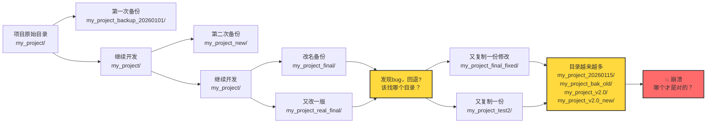
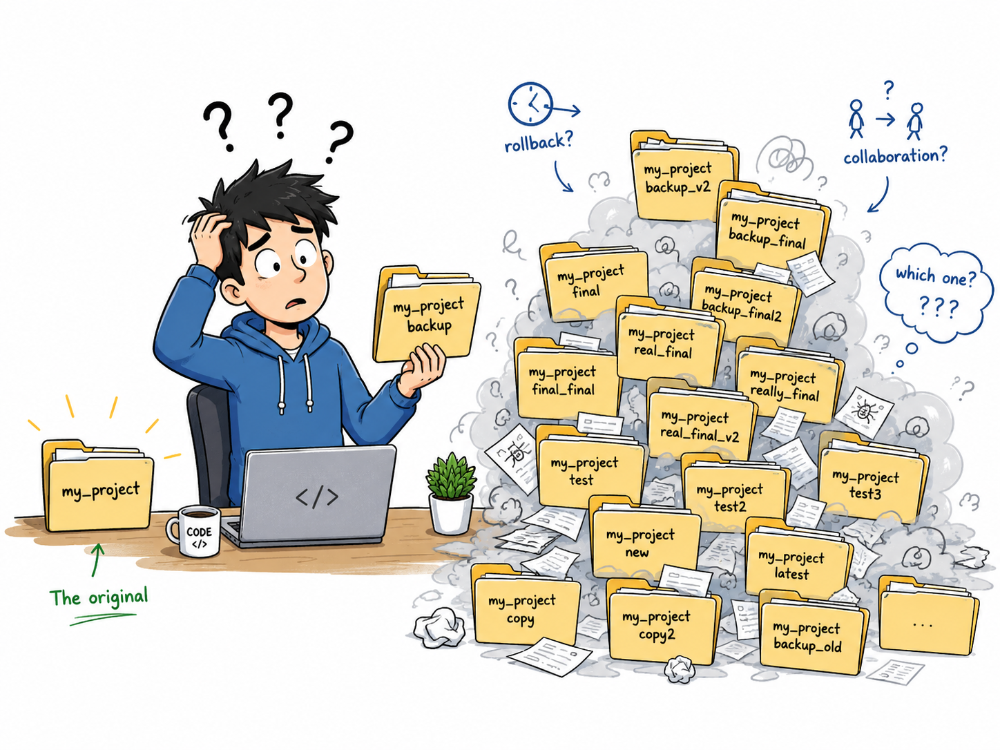
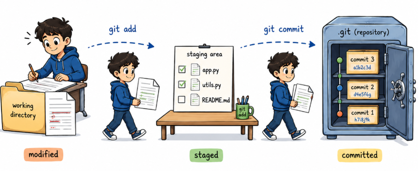
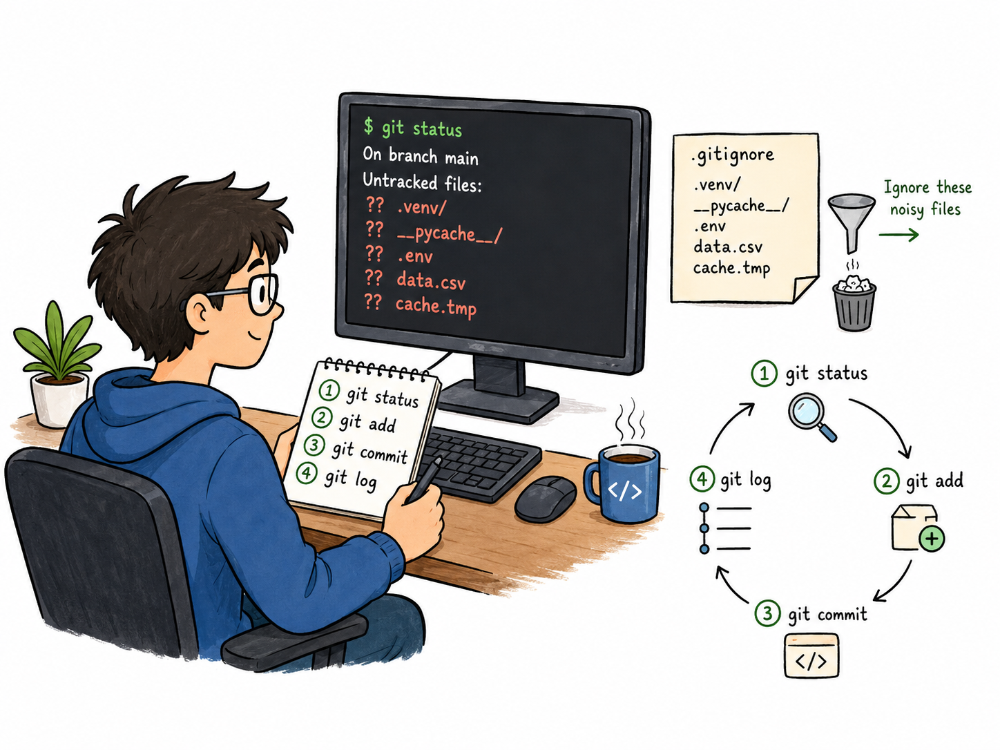
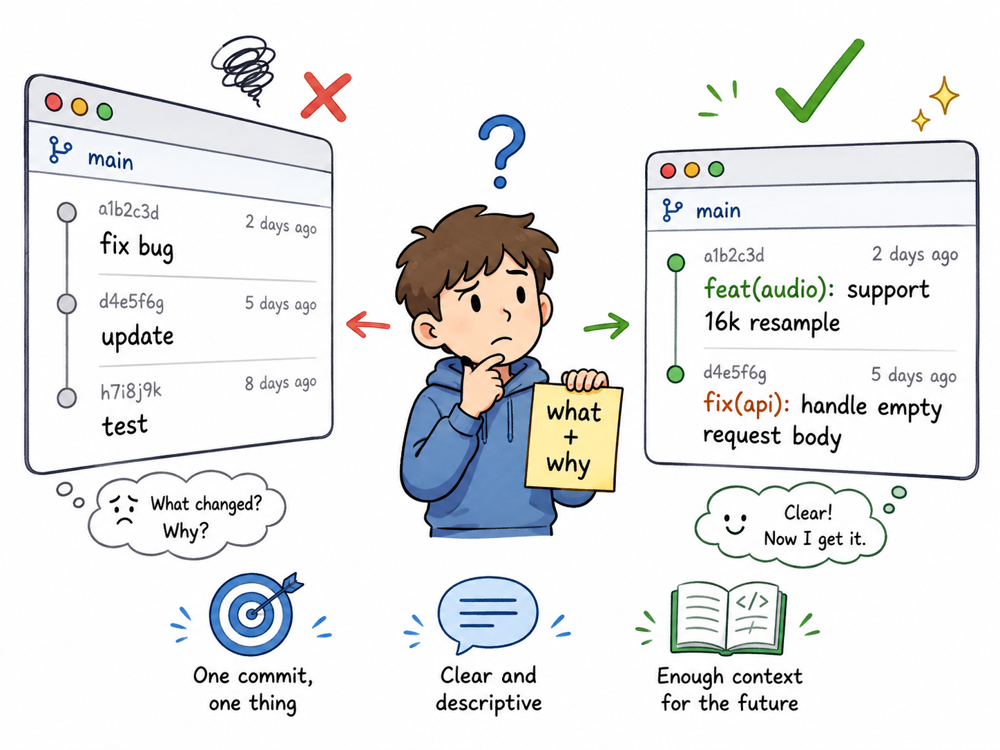
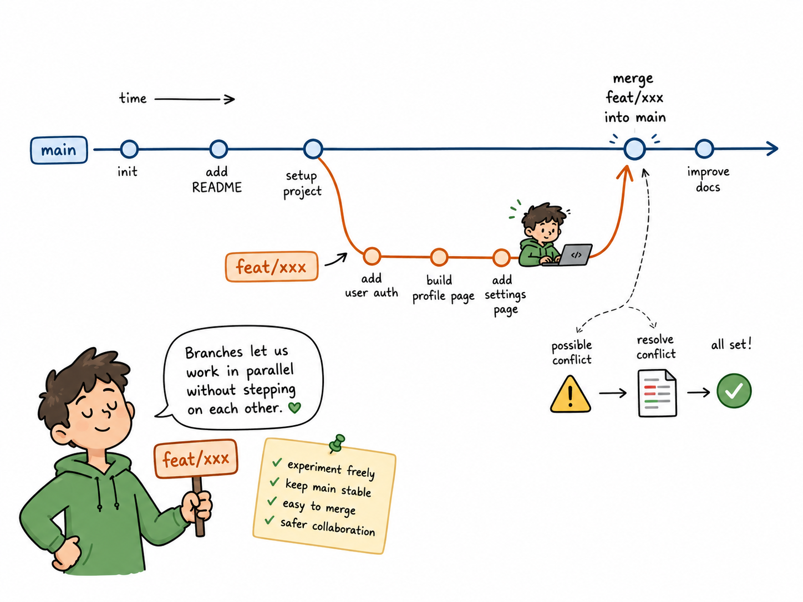
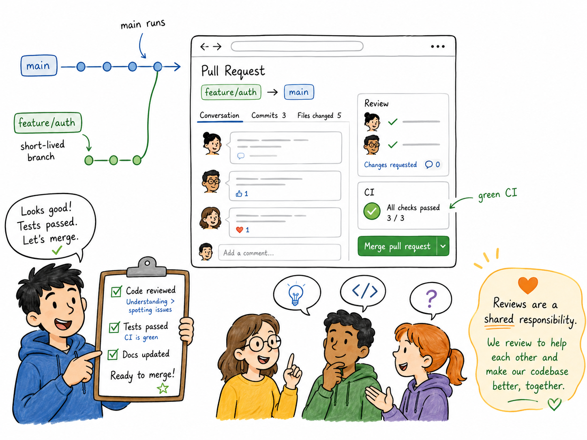

---
kernelspec:
  name: book-venv
  display_name: Python 3 (book)
---

# Git 工作流

学完本节，你能回答：

- 为什么团队要用 Git 而不是复制文件夹？
- 怎样写出可读的提交？怎样用分支并行开发并通过 PR 合入主线？
- 日常提交前要检查什么？

> Git 是团队的"会议记录本"——每一笔提交都写清楚谁、什么时候、改了啥、为什么。翻记录不是为了找谁背锅，而是为了知道这个项目是怎么一步步走到今天的。

Git 分支就像《洛基》里的时间线，神圣时间线（`main`）是唯一的、稳定的、所有人都依赖的。但总有人想加点新功能、修个 bug，于是从主时间线分叉出去，形成一条分支时间线。TVA（代码审查者）会在分支时间线里检查：代码是否正确、测试是否通过、逻辑是否违背"神圣时间线"的稳定法则。检查通过，分支被合入主线，时间线收束，一切归位。检查不通过，分支被修剪（reject 或 delete），时间变异管理局穿越时空将时间罪犯抓走裁剪。

## 为什么需要版本管理

在没有版本管理出现之前，开发者用最原始的方式"管理"代码版本——复制整个目录，改个名字，再加个日期后缀。一段时间后，目录就变成了这样：





这个场景背后有三个致命问题：

- **回退靠猜**：出了 bug，不知道哪个目录是"最后一版能跑的"
- **备份靠复制**：占空间不说，还丢失了"谁、什么时候、为什么"改的上下文
- **协作靠微信**：你改一点发给我，我改一点再发给你，谁也不知道哪个版本是可用的

**Git 用三件事把这些问题一次性解决**：

1. **每次提交都是一个完整的快照**：不像复制目录那样重存整个文件夹，Git 只存变更，但随时能恢复出任意版本的完整目录。想回退？一个命令的事。
2. **历史是完整的**：每个提交都有作者、时间、说明。`git log` 就是项目的编年史，谁在什么时候为了什么改了哪一行——全部可查。
3. **分支是轻量级的**：SVN[^svn] 时代分支是"复制整个目录"，重量级且慢。Git 的分支只是一个 41 字节的文件指针，创建只需一瞬间。这彻底改变了协作方式，所以你可以随时开、随时合。

## Git 的三个状态

理解 Git 的运作，先记住三个状态。这是 Pro Git[^gitpro] 开篇的核心概念：



| 状态 | 含义 | 对应区域 |
|------|------|----------|
| **已修改（modified）** | 你改了文件，但还没告诉 Git | 工作目录（Working Directory） |
| **已暂存（staged）** | 你把改好的文件标记为"准备提交" | 暂存区（Staging Area） |
| **已提交（committed）** | 你把暂存区的改动永久存入了 Git | Git 仓库（Git Directory） |

对应的 Git 命令就是：

```bash
# 修改文件 → 已修改
vim main.py
# 添加到暂存区 → 已暂存
git add main.py
# 提交 → 已提交
git commit -m "fix: handle empty input"
```

## Git 初始化与项目绑定

在[依赖与虚拟环境](dependencies_virtualenv.md)中，我们用 `uv init` 创建了项目并生成了 `pyproject.toml`。

```bash
$ uv init myproject
Initialized project `myproject` at `~/myproject`
$ cd myproject/
$ tree .
.
├── README.md
├── pyproject.toml
└── src
    └── myproject
        └── __init__.py

3 directories, 3 files
$ git status
On branch master

No commits yet

Untracked files:
  (use "git add <file>..." to include in what will be committed)
        .gitignore
        .python-version
        README.md
        pyproject.toml
        src/

nothing added to commit but untracked files present (use "git add" to track)
```

但项目目录本身还不是一个 Git 仓库——Git 和 Python 项目管理是两套系统，需要分别初始化。

```bash
# 创建项目（已有则跳过）
uv init myproject
cd myproject
# 初始化 Git 仓库
git init
# 检查状态（应看到一堆未跟踪的文件）
git status
```

`git init` 会在当前目录创建 `.git` 子目录，这是 Git 存储所有版本信息的"数据库"。`.git` 目录就是仓库本身——删除它，所有历史记录随之消失。

**第一次配置（每个机器只需一次）**：

```bash
git config --global user.name "你的名字"
git config --global user.email "你的邮箱"
```

## .gitignore：告诉 Git 忽略什么

`git status` 总会列出未跟踪文件，但并非所有文件都该入库——编译产物、虚拟环境、操作系统垃圾文件、含隐私的数据都不该进仓库。`.gitignore` 就是给 Git 的“黑名单”：列在其中的路径会被 Git 视作不存在。



**规则**：

- 每行一条模式，`#` 开头为注释
- `*.pyc` 忽略所有 `pyc` 文件；`__pycache__/` 忽略整个目录；`!` 开头为“不忽略”（白名单），如 `!.env.example`
- 模式对所有子目录生效，带 `/` 则锚定到仓库根目录

该文件本身**应该提交**，且越早提交越好——否则已提交的垃圾文件需用 `git rm --cached` 才能移出跟踪。

直接可用的示例（覆盖 Python + 本课程实验一的数据与环境）：

```gitignore
# Python 产物与缓存
__pycache__/
*.pyc
*.pyo
*.pyd
.pytest_cache/
.mypy_cache/
.ruff_cache/
.pytest_cache/
.coverage
htmlcov/

# 虚拟环境与构建产物
.venv/
venv/
.uv/
dist/
build/
*.egg-info/
*.whl

# 操作系统
.DS_Store
Thumbs.db
*~
*.swp

# 编辑器
.vscode/
.idea/
*.sublime-project
*.sublime-workspace

# 项目数据与隐私
data/
*.xlsx
*.pdf
*.docx
*.zip
.env
.env.*
!.env.example
```

按需裁剪：纯课程项目保留 `__pycache__/.venv/data/*.xlsx/*.pdf` 即可；含密钥的项目务必忽略 `.env`。

已误提交的文件：

```bash
# 从仓库移出但保留本地文件
git rm --cached -r __pycache__/
git rm --cached .env
git commit -m "chore: stop tracking ignored files"
```

## 最小循环：改、存、记、看

日常开发中，你最常用的是这条循环——改文件、看状态、进暂存、写提交、看历史。先把这条循环跑顺，再学分支也不迟。

```bash
# 最小循环
git status                    # 看哪些文件被改了
git add <file>                # 把改动放入暂存区
git commit -m "feat: add audio resample helper"  # 提交
git log --oneline -5          # 看最近5条提交
```

要点：提交前先 `git status` 确认改了什么，比直接 `git add .` 更可控。

## 提交信息规范：让历史可读

提交是给人看的。好的提交只做一件事，信息包含"改了什么、为什么改"。太大的提交让 Review 难读，回退也难挑。

**提交信息规范**，推荐使用约定式提交（Conventional Commits）格式：

```
<type>(<scope>): <subject>
[optional body]
[optional footer]
```



常用 type 前缀：

| 前缀 | 用途 |
|------|------|
| `feat` | 新功能 |
| `fix` | 修复 bug |
| `docs` | 文档更新 |
| `refactor` | 重构（不改变功能） |
| `test` | 测试相关 |
| `chore` | 构建、工具配置等杂项 |
| `perf` | 性能优化 |

```bash
# 好提交
git commit -m "feat(audio): support 16k resample"

# 更好的提交（含正文）
git commit -m "fix(api): handle empty request body\
之前当请求体为空时服务会抛出 ValueError，现返回 400 状态码。\
影响范围：/api/transcribe 端点"

# 差提交（不要这样写）
git commit -m "fix bug"
```

> Pro Git 建议：*"每次提交应该是一个逻辑上独立的变化单元"*——一个提交只做一件事，不要把"加新功能"和"修另一个 bug"放在同一个提交里。

```bash
# 只提交本次意图相关文件
git status
git add src/mypackage/audio.py tests/test_audio.py
git commit -m "feat(audio): support 16k resample"
git log --oneline -5

# 按需撤销暂存或修改最后一次提交
git restore --staged <file>
git commit --amend -m "feat(audio): support 16k resample with fallback"
```

小技巧：写提交前用 `git diff --staged` 再看一遍将要提交的内容，等于给自己做一次轻量 Review。

## 分支与合并：并行不踩脚

分支让"正在做的事"与"稳定的主线"分开。常见做法是在 `main` 上保持可运行状态，新功能或修复都从 `main` 开分支，完成后合回。

Pro Git 的核心观点：*"Git 的分支实质上只是包含所指对象校验和（40 字节）的文件。分支的新建和合并都非常简单、快速，所以 Git 鼓励频繁创建和使用分支。"*



```bash
# 分支基础命令
git branch                    # 查看本地分支列表
git branch <name>             # 创建新分支（不切换）
git switch <name>             # 切换到指定分支
git switch -c <name>          # 创建并切换到新分支（常用）
git branch -d <name>          # 删除分支（已合并）
git branch -D <name>          # 强制删除分支（未合并）

# 从 main 开新分支，做完再合回
git switch main
git pull
git switch -c feat/transcribe-cli
# ... 修改、提交 ...
git switch main
git merge feat/transcribe-cli
git branch -d feat/transcribe-cli
```

**处理冲突**：冲突不可怕，Git 会标出冲突区间，人工决定保留哪部分，再 `add` 后提交即可。

```bash
# 若有冲突，编辑冲突文件后
git add <resolved-file>
git commit
# 或中止合并
git merge --abort
```

记住两个习惯：

- 分支名用 `feat/`、`fix/`、`docs/` 前缀让人一眼看懂意图
- 合并前先 `git fetch` 再 `git log --oneline main..feat/xxx` 预览要合入的提交，比直接合更安心

## 远端与 PR：协作的线上接口

本地分支需要通过远端与他人协作。远端是 `origin` 指向的线上仓库（如 GitHub、GitLab），`push` 把本地提交推上去，`pull` 或 `fetch` + `merge` 把线上更新拿下来。



PR（Pull Request）是在线上发起的"请求合入"，提供讨论、Review 与 CI 校验的入口。它不只是代码合并的通道，更是**协作的契约**——代码合入主线前，必须经过 Peer Review 和自动化检查。

```bash
# 第一次推分支并关联远端
git remote add origin git@github.com:username/myproject.git
git push -u origin feat/transcribe-cli
# 日常同步与清理
git fetch --prune
git pull --ff-only
git push
# 已合入的分支在本地清理
git branch -d feat/transcribe-cli
git push origin --delete feat/transcribe-cli
```

## 多人协作原则

团队协作不是"谁能把代码合进去"的比赛，而是**如何让每一行合入的代码都经得起审视**。以下五条原则是协作的底线：

1. **main 永远可运行**：`main` 分支的代码必须随时可部署。合入前确保所有测试通过、不会破坏已有功能。这条原则是团队信任的基础——如果 `main` 都会坏，没人敢基于它开新分支。
2. **短命分支**：分支的生命周期越短，合并冲突越少。理想情况是一个功能分支从开出到合入不超过 1-2 天。长期分支会积累大量差异，合并时像拆炸弹。
3. **Review**：代码合入前必须经过至少一位同事的 Review。Review 不是走过场，而是看逻辑是否有遗漏、命名是否清晰、是否有潜在的性能问题。Review 的目标不是挑错，是共同对合入的代码负责。
4. **CI**：CI（持续集成）在每次 push 后自动运行测试、检查格式。PR 合入前必须全部绿色。这条原则把"本地能跑"升级为"所有人都能跑"。
5. **提交信息要有意义**：回看历史时，提交信息是唯一的线索。`fix bug` 和 `fix: handle empty audio input gracefully` 的区别，三个月后你再看就明白了。

## 日常 checklist：提交前五分钟

把下面这份清单贴在手边，提交与推远端前逐项过一遍，能避免大多数"后悔提交"。

1. `git status` 看清改了哪些文件，是否有遗漏或误改
2. `git diff` 与 `git diff --staged` 各看一遍，确认变更符合本次意图
3. 检查 `.gitignore` 是否已忽略 `__pycache__/`、`*.pyc`、`.venv/`、`data/` 等不应入库的产物
4. 在本地跑最快的一轮校验，如 `ruff check .` 或 `pytest -q`
5. 写提交信息时回答"改了什么、为什么"，用约定式提交格式
6. 推远端前先 `git pull --ff-only` 或 `git fetch`，避免在线上产生不必要的合并

[^svn]:一种版本管理工具
[^gitpro]:Pro Git原书链接：https://bingohuang.gitbooks.io/progit2/content/